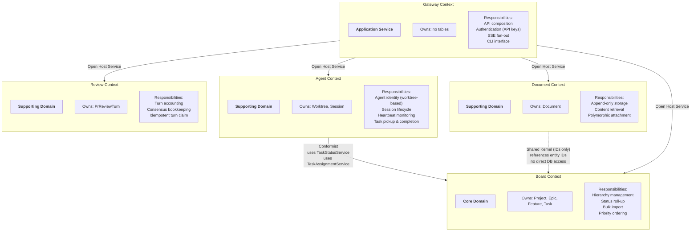

# cloglog — DDD Context Map & Ubiquitous Language

## Context Map

## Context Relationships

| Upstream | Downstream | Relationship | Interface |
|----------|------------|-------------|-----------|
| **Board** | Agent | Conformist | Agent conforms to Board's `TaskStatusService` and `TaskAssignmentService` protocols. Board dictates task state transitions; Agent follows. |
| **Board** | Document | Shared Kernel (IDs) | Document stores `attached_to_type` + `attached_to_id` as opaque references to Board entities. No direct table access. |
| **Board** | Gateway | Open Host Service | Gateway calls Board's routes and services through a published API. |
| **Agent** | Gateway | Open Host Service | Gateway calls Agent's routes for worktree/session queries. |
| **Document** | Gateway | Open Host Service | Gateway calls Document's routes for document retrieval. |
| **Review** | Gateway | Open Host Service | Gateway's two-stage review sequencer calls Review's services through the `IReviewTurnRegistry` interface for turn accounting. Gateway imports only the protocol — never `src.review.models` or `src.review.repository` directly. |

## Ubiquitous Language (Glossary)

### Board Context

| Term | Definition |
|------|-----------|
| **Project** | A source code repository tracked by cloglog. Has its own API key for agent authentication. |
| **Epic** | A large initiative within a project. Optionally maps to a DDD Bounded Context in the target project. Contains Features. |
| **Feature** | A deliverable unit of work under an Epic. Contains Tasks. Can depend on other Features (dependency prevents premature parallel work). |
| **Task** | The smallest unit of work, sized for a single agent session. Appears as a card on the Kanban board. Moves through columns: backlog → assigned → in_progress → review → done (or blocked). |
| **Status Roll-Up** | Automatic recomputation of Feature/Epic status from their children. When all Tasks are done, the Feature becomes done. When all Features are done, the Epic becomes done. |
| **Import** | Bulk creation of Epics/Features/Tasks from a structured JSON payload. The bridge between brainstorming output and the board. |
| **Expedite** | A task priority level indicating urgency. Expedite tasks are visually distinct and should be picked up first. |
| **Position** | Display ordering within a column or hierarchy. Determines card order on the board. |

### Agent Context

| Term | Definition |
|------|-----------|
| **Worktree** | The persistent identity of an agent. Named after and tied to a git worktree path on the host. Survives session restarts. If a session registers with a known worktree path, it reconnects to the existing identity. |
| **Session** | An ephemeral record of a single Claude Code terminal run within a worktree. Has a start time and optional end time. Multiple sessions may exist for one worktree over time. |
| **Registration** | The act of a session announcing itself to cloglog. Upserts the worktree (creating it if new, reconnecting if existing) and creates a new session record. |
| **Heartbeat** | A periodic ping (every 60s) from an active session. Proves the agent is alive. If no heartbeat is received for 3 minutes (heartbeat timeout), the worktree is marked offline. |
| **Offline** | A worktree state meaning no active session is running. Could be intentional (session ended) or due to crash/timeout. The task remains in its current column — it does not revert. |
| **Task Pickup** | When an agent calls `start_task` to begin working on a task. Moves the task to in_progress and sets the worktree's current_task. |
| **Task Completion** | When an agent calls `complete_task` to finish a task. Moves it to done, triggers roll-up, clears current_task, and returns the next assigned task if available. |

### Document Context

| Term | Definition |
|------|-----------|
| **Document** | An append-only record of a design artifact — specs, plans, design docs, or other files generated during brainstorming or agent work. Stores the actual content (not a file path reference). |
| **Attachment** | The link between a document and a Board entity (Epic, Feature, or Task). Stored as a polymorphic reference (`attached_to_type` + `attached_to_id`). |
| **Source Path** | The original file path where the document was generated. Stored as metadata only — the content is in the database, not retrieved from this path. |
| **Document Type** | Classification of a document: `spec` (design specification), `plan` (implementation plan), `design` (detailed design), or `other`. Determines the color of the chip on the dashboard. |

### Gateway Context

| Term | Definition |
|------|-----------|
| **API Key** | A per-project bearer token used by agents to authenticate. Generated when a project is created. Stored as a hash in the database. Shown once to the user, then placed in `~/.cloglog/credentials.d/<project_slug>` (multi-project hosts, T-382) or `~/.cloglog/credentials` (single-project hosts), both mode `0600` — or exported as `CLOGLOG_API_KEY` in the launcher's environment. MUST NOT live in `.mcp.json` or any per-worktree file (T-214); the MCP server reads only those three sources, in that precedence. See `docs/setup-credentials.md`. |
| **SSE Stream** | A Server-Sent Events endpoint per project. The dashboard subscribes to receive real-time updates when tasks change status, agents come online/offline, or documents are attached. |
| **Quality Gate** | The mandatory `make quality` check that must pass before any commit, push, or PR. Enforced by a Claude Code hook. Includes lint, type check, tests, and coverage. |

### Review Context

| Term | Definition |
|------|-----------|
| **Turn** | One iteration of one reviewer (opencode or codex) against a single PR commit SHA. Produces zero or more findings and one GitHub review POST. Limited to 5 turns for opencode and 2 for codex per `docs/design/two-stage-pr-review.md`. |
| **Stage** | Either `opencode` (stage A) or `codex` (stage B). A full review session runs both stages serially, opencode first. |
| **Consensus** | Signal that a reviewer's per-stage loop may short-circuit before its turn cap. Reached when the reviewer emits `status: "no_further_concerns"` in its structured output OR produces zero new findings vs prior turns on the same SHA (spec §1.1). |
| **Turn Registry** | The `IReviewTurnRegistry` Protocol exposed by `src/review/interfaces.py`. Backed by `ReviewTurnRepository` writing to the `pr_review_turns` table. Gateway consumes the protocol; the concrete repository is internal to the Review context. |

### Cross-Context Terms

| Term | Definition |
|------|-----------|
| **Bounded Context (DDD)** | In the target project (the one agents are building), a Bounded Context maps to an Epic on the cloglog board. This is optional — not every Epic represents a Bounded Context. |
| **agent-vm** | The local tooling bundle for agents — credentials, runtime scripts, and helpers mounted at `~/.agent-vm/`. Not a virtual machine and not a separate filesystem; agents, the MCP server, and cloglog all run on the same host. |
| **cloglog-mcp** | The MCP server that exposes Claude Code tools (`register_agent`, `start_task`, `complete_task`, etc.) which translate to HTTP calls to the cloglog API. Runs on the same host as the agent and the backend. |

## Auth Contract

Every HTTP route on the gateway passes through `ApiAccessControlMiddleware`
(`src/gateway/app.py`) BEFORE the per-route `Depends(...)` resolver runs.
The middleware accepts ONE of three credential shapes and rejects anything
else with `401 Authentication required` (no credential at all) or `403`
(present but invalid, or agent-scoped token on a non-agent route).

| Route prefix | Public? | Required credential |
|---|---|---|
| `/health` | Yes (no auth) | — (bypassed by middleware) |
| `/api/v1/agents/*` | No | `Authorization: Bearer <project-api-key>` OR a valid agent token; per-route `Depends(...)` narrows further (agent token for heartbeat/unregister, supervisor key for destructive ops — see `src/gateway/auth.py`). |
| `/api/v1/projects/{id}/worktrees` | **No — T-258** | `X-Dashboard-Key: <DASHBOARD_SECRET>` OR `X-MCP-Request: true` + `Authorization: Bearer <project-api-key>`. T-244 review flagged that CLI and in-tree callers (`src/gateway/cli.py`, `scripts/sync_mcp_dist.py`) silently relied on env-passthrough of the dashboard key. The route stays authed; callers pass the header explicitly and a local guard short-circuits with a clear error when the env var is missing (`_require_dashboard_key` in `src/gateway/cli.py`). |
| All other `/api/v1/*` routes | No | `X-Dashboard-Key: <DASHBOARD_SECRET>` OR `X-MCP-Request: true` + `Authorization: Bearer <project-api-key>` (MCP client acting on behalf of an agent). |

Status codes surfaced by the middleware:

| Failure mode | Status | Detail |
|---|---|---|
| No `Authorization`, no `X-MCP-Request`, no `X-Dashboard-Key` | `401` | `Authentication required` |
| `X-Dashboard-Key` present but does not match `settings.dashboard_secret` | `403` | `Invalid dashboard key` |
| Agent-scoped token on a non-`/api/v1/agents/*` route | `403` | `Agents can only access /api/v1/agents/* routes` |

`docs/design.md § Authentication Flow` mirrors this table; keep the two
in sync when the middleware changes. The E2E regression suite in
`tests/e2e/test_access_control.py` pins every row here, including the
T-258 regression tests for `/api/v1/projects/{id}/worktrees`.
