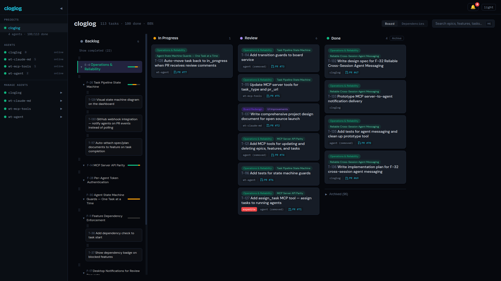

# T-114: Transition Guards for Board Service

*2026-04-08T11:18:38Z by Showboat 0.6.1*
<!-- showboat-id: 12e40cb3-4dfd-4296-a355-9f2d2f308c23 -->

Added server-side transition guards to the agent service: one active task per agent, PR URL required for review, review-to-in_progress transitions, and agents blocked from marking tasks done.

## Guard 1: One active task per agent

```bash
uv run pytest tests/agent/test_unit.py::TestAgentService::test_start_task_blocked_when_active_task --no-header -q 2>&1 | tail -1 | sed "s/ in [0-9.]*s//"
```

```output
1 passed
```

## Guard 1b: Start allowed after previous task done

```bash
uv run pytest tests/agent/test_unit.py::TestAgentService::test_start_task_allowed_after_previous_done --no-header -q 2>&1 | tail -1 | sed "s/ in [0-9.]*s//"
```

```output
1 passed
```

## Guard 3: PR URL required for review

```bash
uv run pytest tests/agent/test_unit.py::TestAgentService::test_review_requires_pr_url --no-header -q 2>&1 | tail -1 | sed "s/ in [0-9.]*s//"
```

```output
1 passed
```

## Guard 4: Review to in_progress allowed

```bash
uv run pytest tests/agent/test_unit.py::TestAgentService::test_review_to_in_progress_allowed --no-header -q 2>&1 | tail -1 | sed "s/ in [0-9.]*s//"
```

```output
1 passed
```

## Guard 5: Agents cannot move to done

```bash
uv run pytest tests/agent/test_unit.py::TestAgentService::test_agent_cannot_move_to_done --no-header -q 2>&1 | tail -1 | sed "s/ in [0-9.]*s//"
```

```output
1 passed
```

## Integration tests

```bash
uv run pytest tests/agent/test_integration.py::TestTransitionGuardsAPI --no-header -q 2>&1 | tail -1 | sed "s/ in [0-9.]*s//"
```

```output
5 passed
```

## Pipeline ordering tests (T-116)

```bash
uv run pytest tests/agent/test_integration.py::TestPipelineOrderingAPI --no-header -q 2>&1 | tail -1 | sed "s/ in [0-9.]*s//"
```

```output
3 passed
```

## Review to in_progress auto-move (T-128)

The `review → in_progress` transition is allowed by the state machine, enabling agents to auto-move tasks back when PR review comments arrive.

### Integration test proof

```bash
uv run pytest tests/agent/test_integration.py::TestTransitionGuardsAPI::test_review_to_in_progress_allowed --no-header -q 2>&1 | tail -1 | sed "s/ in [0-9.]*s//"
```

```output
1 passed
```

## Full agent test suite

```bash
uv run pytest tests/agent/ --no-header -q 2>&1 | tail -1 | sed "s/ in [0-9.]*s//"
```

```output
70 passed
```

```bash {image}

```



```bash {image}

```


