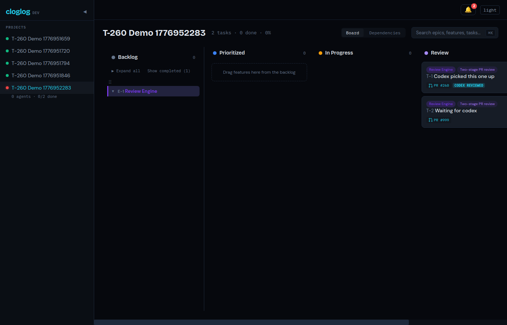
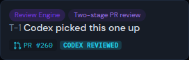
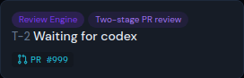

# A review-column task card shows a 'codex reviewed' pill the moment codex engages with the PR. The badge is boolean and read-only — projected from `pr_review_turns` via the Review context's Open Host Service.

*2026-04-23T13:51:30Z by Showboat 0.6.1*
<!-- showboat-id: 4b4ea1b3-0018-42f0-b2c5-a5410def304d -->

### Visual proof — live dashboard, two cards side by side

Seeded two tasks on a fresh demo project, both in the `review` column, both
with a pr_url set. Task A has a `pr_review_turns` row for `stage='codex'`;
task B does not. Captured with headless Rodney against the worktree's live
backend (`:48616`) + frontend (`:48617`).

#### Full review column



#### Card A — codex has engaged → badge visible



The `codex reviewed` pill sits next to the PR link, matching the existing
`Merged` badge's visual weight and position.

#### Card B — no codex turn yet → badge hidden



Both cards sit in the same column and have identical `pr_url`/`status`
shape. The only difference is the presence of a `pr_review_turns` row
against task A's pr_url with `stage='codex'` — that single row flips the
field True in `TaskCard.codex_review_picked_up`.

### API-level snapshot backing the screenshots

The live board API returned the snapshot below while the screenshots above
were captured. Task A's field is `true`, task B's is `false` — no other
state differs between them.

```bash
echo '{
  "with_badge_task": {
    "title": "Codex picked this one up",
    "codex_review_picked_up": true
  },
  "without_badge_task": {
    "title": "Waiting for codex",
    "codex_review_picked_up": false
  }
}'
```

```output
{
  "with_badge_task": {
    "title": "Codex picked this one up",
    "codex_review_picked_up": true
  },
  "without_badge_task": {
    "title": "Waiting for codex",
    "codex_review_picked_up": false
  }
}
```

### Why the badge disappears when a task moves back to `in_progress`

Scope from the user: "When back in progress remove it." `TaskCard.tsx`
wires the `codexReviewed` prop as `task.status === 'review' && task.codex_review_picked_up`.
If a reviewer finds issues and the agent pulls the card back to
`in_progress`, the first conjunct evaluates false and the pill stops
rendering — no explicit teardown needed, no separate transition event.
Regression tests at `frontend/src/components/TaskCard.test.tsx` pin both
the visible-in-review and hidden-in-in_progress cases.

### Verify-safe file pins

Everything below is a deterministic `exec` block — no live service, no
timings, no repo-wide counts. These re-run under `uvx showboat verify`
(and `make quality`'s demo-check step) so the code that drives the live
demo above stays wired correctly as the codebase evolves.

```bash
S=src/board/schemas.py
   grep -q "codex_review_picked_up: bool" "$S" && echo "taskcard_has_field=yes" || echo "taskcard_has_field=MISSING"
   awk "/^class TaskResponse/{flag=1; next} /^class [A-Z]/{flag=0} flag" "$S" > /tmp/t260_resp.py
   awk "/^class TaskCard/{flag=1; next} /^class [A-Z]/{flag=0} flag" "$S" > /tmp/t260_card.py
   grep -q "codex_review_picked_up" /tmp/t260_card.py \
     && echo "on_TaskCard=yes" || echo "on_TaskCard=MISSING"
   grep -q "codex_review_picked_up" /tmp/t260_resp.py \
     && echo "on_TaskResponse=LEAK" || echo "on_TaskResponse=no (correct)"
```

```output
taskcard_has_field=yes
on_TaskCard=yes
on_TaskResponse=no (correct)
```

```bash
I=src/review/interfaces.py
   R=src/review/repository.py
   grep -q "async def codex_touched_pr_urls" "$I" && echo "interface_has_method=yes" || echo "interface_has_method=MISSING"
   grep -q "async def codex_touched_pr_urls" "$R" && echo "repository_implements_method=yes" || echo "repository_implements_method=MISSING"
   grep -q "PrReviewTurn.stage == \"codex\"" "$R" && echo "repository_filters_stage_codex=yes" || echo "repository_filters_stage_codex=MISSING"
   grep -q "PrReviewTurn.project_id == project_id" "$R" && echo "repository_filters_project=yes" || echo "repository_filters_project=MISSING"
```

```output
interface_has_method=yes
repository_implements_method=yes
repository_filters_stage_codex=yes
repository_filters_project=yes
```

```bash
grep -rE "from src\\.review\\.(models|repository)" src/board > /tmp/t260_boundary.out 2>&1 || true
   if [ -s /tmp/t260_boundary.out ]; then
     echo "board_imports_review_internals=LEAK"; cat /tmp/t260_boundary.out
   else
     echo "board_imports_review_internals=no (correct)"
   fi
   grep -q "from src.review.services import make_review_turn_registry" src/board/routes.py \
     && echo "board_uses_ohs_factory=yes" || echo "board_uses_ohs_factory=MISSING"
```

```output
board_imports_review_internals=no (correct)
board_uses_ohs_factory=yes
```

```bash
E=src/shared/events.py
   L=src/gateway/review_loop.py
   grep -q "REVIEW_CODEX_TURN_STARTED" "$E" && echo "event_type_defined=yes" || echo "event_type_defined=MISSING"
   grep -q "review_codex_turn_started" "$E" && echo "event_type_string_value=yes" || echo "event_type_string_value=MISSING"
   grep -q "if self._stage == \"codex\":" "$L" && echo "emit_gated_on_codex_stage=yes" || echo "emit_gated_on_codex_stage=MISSING"
   grep -q "EventType.REVIEW_CODEX_TURN_STARTED" "$L" && echo "emit_uses_new_event=yes" || echo "emit_uses_new_event=MISSING"
```

```output
event_type_defined=yes
event_type_string_value=yes
emit_gated_on_codex_stage=yes
emit_uses_new_event=yes
```

```bash
Y=docs/contracts/baseline.openapi.yaml
   awk "/^    TaskCard:/{flag=1; next} /^    [A-Z]/{flag=0} flag" "$Y" > /tmp/t260_taskcard_block.yaml
   grep -q "codex_review_picked_up:" /tmp/t260_taskcard_block.yaml \
     && echo "contract_has_field_on_TaskCard=yes" || echo "contract_has_field_on_TaskCard=MISSING"
   grep -A1 "codex_review_picked_up:" /tmp/t260_taskcard_block.yaml | grep -q "type: boolean" \
     && echo "contract_field_is_boolean=yes" || echo "contract_field_is_boolean=MISSING"
   grep -A3 "codex_review_picked_up:" /tmp/t260_taskcard_block.yaml | grep -q "default: false" \
     && echo "contract_field_defaults_false=yes" || echo "contract_field_defaults_false=MISSING"
```

```output
contract_has_field_on_TaskCard=yes
contract_field_is_boolean=yes
contract_field_defaults_false=yes
```

```bash
G=frontend/src/api/generated-types.ts
   T=frontend/src/components/TaskCard.tsx
   P=frontend/src/components/PrLink.tsx
   H=frontend/src/hooks/useSSE.ts
   grep -q "codex_review_picked_up: boolean" "$G" && echo "generated_types_field=yes" || echo "generated_types_field=MISSING"
   grep -q "codexReviewed=" "$T" && echo "tsx_wires_badge_prop=yes" || echo "tsx_wires_badge_prop=MISSING"
   grep -q "task.status === .review." "$T" && echo "tsx_gates_on_review_column=yes" || echo "tsx_gates_on_review_column=MISSING"
   grep -q "pr-codex-badge" "$P" && echo "prlink_has_codex_class=yes" || echo "prlink_has_codex_class=MISSING"
   grep -q "codex reviewed" "$P" && echo "prlink_renders_label=yes" || echo "prlink_renders_label=MISSING"
   grep -q "review_codex_turn_started" "$H" && echo "sse_hook_subscribes=yes" || echo "sse_hook_subscribes=MISSING"
```

```output
generated_types_field=yes
tsx_wires_badge_prop=yes
tsx_gates_on_review_column=yes
prlink_has_codex_class=yes
prlink_renders_label=yes
sse_hook_subscribes=yes
```
