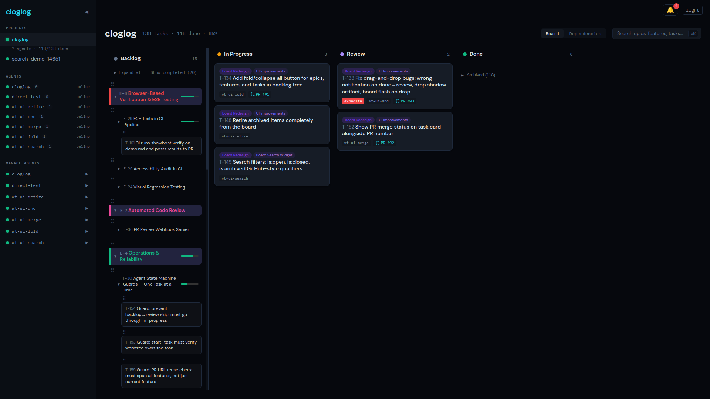
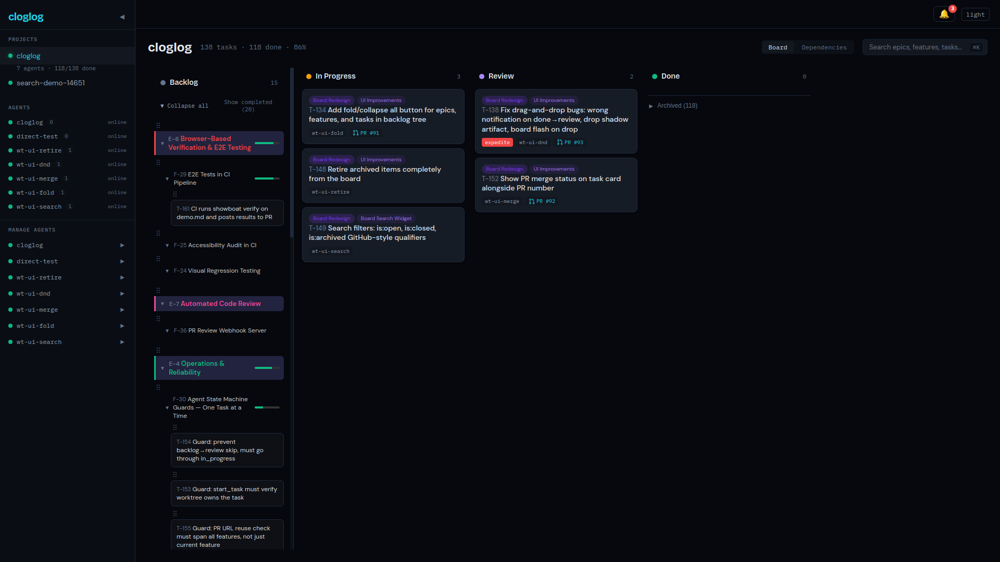

# T-134 Demo: Collapse/Expand All Toggle

## What Changed

Added a toolbar button to the backlog tree that collapses or expands all epics and features at once.

## Before — All Expanded (default)

The backlog tree shows all epics, features, and tasks expanded. The "Collapse all" button appears in the toolbar.

## After — Collapse All clicked

All epics remain visible but features and tasks are hidden. The button switches to "Expand all".

## Behavior

1. **Default state** — all epics and features start expanded, button shows "Collapse all" with down arrow
2. **Collapse all** — clicking hides all features and tasks under every epic instantly
3. **Expand all** — clicking reveals all epics, features, and their backlog tasks
4. **Smart toggle** — manually collapsing any single item switches the button to "Expand all"

## Test Results

4 new tests added, all 18 BacklogTree tests pass (14 existing + 4 new).
Full suite: 197 tests pass (193 existing + 4 new).

- renders collapse all button when tree is expanded
- collapses all epics and features when collapse all is clicked
- expands all epics and features when expand all is clicked
- shows expand all when some items are manually collapsed
