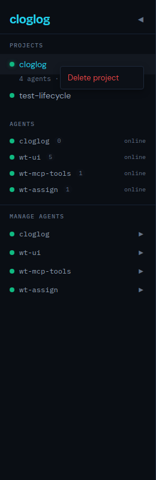

# T-124: Right-click context menu to delete project

*2026-04-07T15:56:36Z by Showboat 0.6.1*
<!-- showboat-id: 4135d83b-85bb-4029-a561-343bb9258372 -->

Right-clicking a project in the sidebar shows a context menu with 'Delete project'. Clicking it calls DELETE /projects/{id} which cascades to remove all epics, features, tasks, and notes.

```bash {image}

```



```bash
cd frontend && NO_COLOR=1 npx vitest run src/components/Sidebar.test.tsx 2>&1 | grep -E '(Tests|Test Files|FAIL|passed|failed)'
```

```output
 Test Files  1 passed (1)
      Tests  18 passed (18)
```

Test delta: 191 -> 193 (+2 new). Context menu rendering and delete callback.
