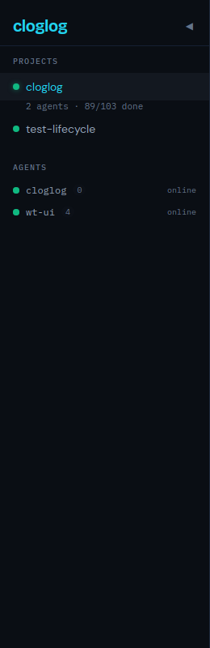
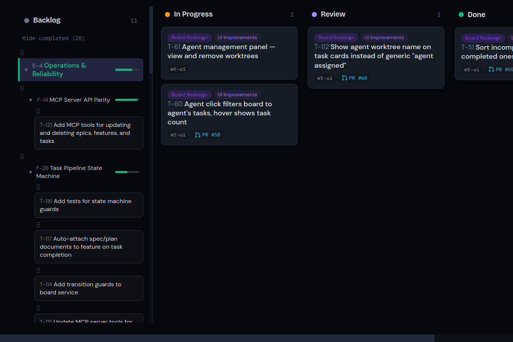

# T-60: Agent click filters board, hover shows task count

*2026-04-07T14:50:31Z by Showboat 0.6.1*
<!-- showboat-id: 15be91e7-9edc-43af-bd13-72b15b201e6b -->

Clicking an agent in the sidebar filters all board columns to show only that agent's tasks. Click again to clear. Each agent shows its task count badge.

```bash {image}

```



After clicking wt-ui, the board filters to only its 4 tasks:

```bash {image}

```



```bash
cd frontend && NO_COLOR=1 npx vitest run src/components/Sidebar.test.tsx src/components/Column.test.tsx 2>&1 | grep -E '(Tests|Test Files|FAIL|passed|failed)'
```

```output
 Test Files  2 passed (2)
      Tests  33 passed (33)
```

Test delta: 178 -> 183 (+5 new). Agent click, filter highlight, task count display, column agent filtering.
