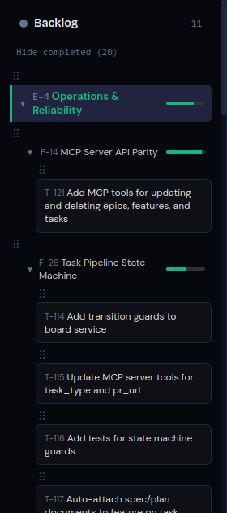
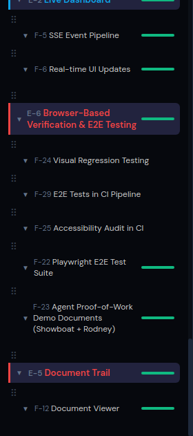

# T-51: Sort Incomplete Features Before Completed in Backlog Tree

*2026-04-07T12:21:42Z by Showboat 0.6.1*
<!-- showboat-id: 420d3678-1776-426f-b38d-b9368381278e -->

When 'Show completed' is toggled on, incomplete epics and features now sort before completed ones. Completed items (with full green progress bars) appear at the bottom of the tree.

```bash {image}

```



Scrolling to the bottom shows completed features (full green progress bars) sorted last:

```bash {image}

```



## Tests

```bash
cd frontend && NO_COLOR=1 npx vitest run src/components/BacklogTree.test.tsx 2>&1 | grep -E '(Tests|Test Files|FAIL|passed|failed)'
```

```output
 Test Files  1 passed (1)
      Tests  14 passed (14)
```

Test delta: 174 -> 176 (+2 new). New tests verify DOM ordering of incomplete before completed for both epics and features.
