# cloglog: A Multi-Agent Kanban for Autonomous AI Coding

> *What if your coding agents could manage themselves — while you reviewed PRs from your phone?*

---

## The Problem

You have five AI coding agents. They're working across different git branches, each building a feature. One is writing a design spec. Another is implementing an API. A third is building the frontend. They need tasks assigned, progress tracked, PRs reviewed, and coordination when their work overlaps.

Without cloglog, you're juggling terminal windows, manually checking heartbeats, and hoping agents don't step on each other's toes. With cloglog, you open a real-time dashboard, see every agent's status, drag tasks between columns, and review PRs — all while the agents self-coordinate through a shared board.

cloglog is a **multi-project Kanban dashboard** purpose-built for managing autonomous AI coding agents. It combines project planning (epics, features, tasks) with agent lifecycle management (registration, heartbeat, messaging, shutdown) in a single system that updates in real-time via Server-Sent Events.

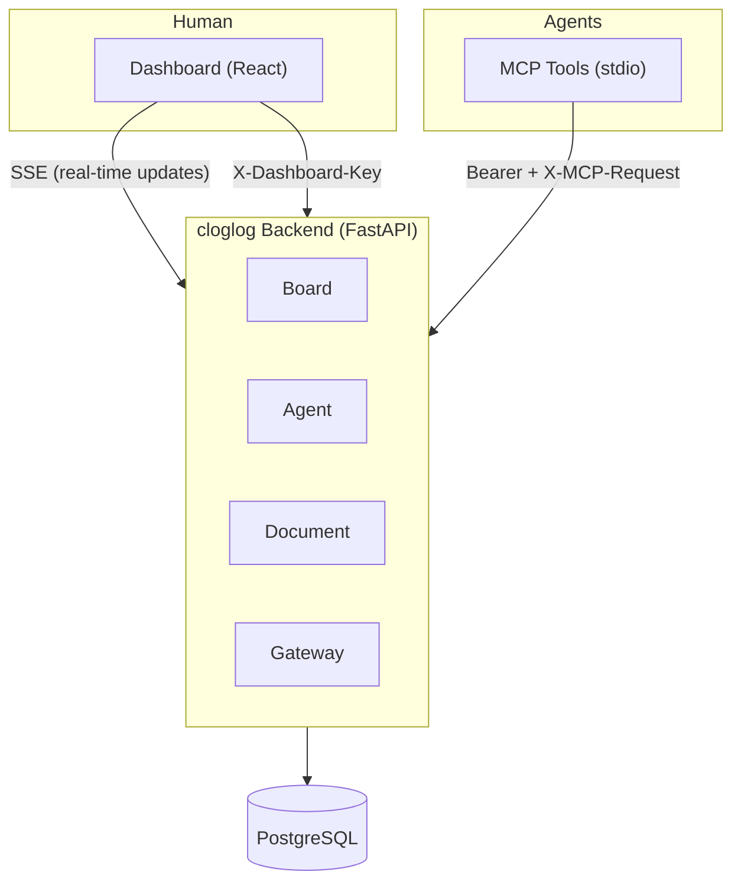

---

## Architecture: Four Bounded Contexts

cloglog follows **Domain-Driven Design** with four bounded contexts. Each context owns its models, services, repository, and routes. They communicate through Protocol interfaces — never by importing each other's internals.

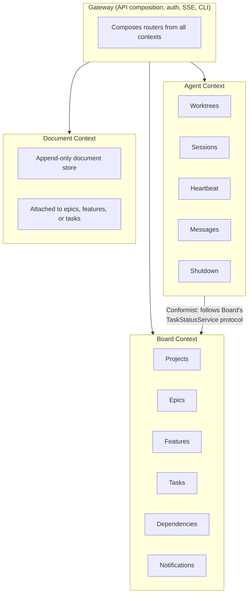

### Context Relationships

| Relationship | Pattern | What it means |
|---|---|---|
| Agent -> Board | **Conformist** | Agent adopts Board's task model wholesale. No translation layer. |
| Document -> Board | **Shared Kernel** | Document stores entity IDs (`attached_to_id`) but never queries Board tables directly. |
| Gateway -> All | **Open Host Service** | Gateway publishes a unified API that composes all contexts. |

### Why DDD?

Each context can be developed in an **isolated git worktree** by a separate agent. The Board agent can't accidentally break Agent code because they're in different directories, enforced by Claude Code hooks that block writes outside assigned paths.

```
src/
 +-- board/          # Board agent's territory
 |   +-- models.py
 |   +-- repository.py
 |   +-- services.py
 |   +-- routes.py
 |   +-- schemas.py
 |   +-- interfaces.py
 |
 +-- agent/          # Agent agent's territory
 |   +-- models.py
 |   +-- repository.py
 |   +-- services.py
 |   +-- routes.py
 |   +-- schemas.py
 |   +-- interfaces.py
 |
 +-- document/       # Document agent's territory
 |   +-- (same structure)
 |
 +-- gateway/        # Gateway agent's territory
 |   +-- app.py
 |   +-- auth.py
 |   +-- sse.py
 |   +-- cli.py
 |   +-- routes.py
 |   +-- notification_listener.py
 |   +-- review_engine.py        # F-36: automated PR code review
 |   +-- webhook.py              # GitHub webhook ingress
 |   +-- webhook_dispatcher.py
 |   +-- webhook_consumers.py
 |   +-- github_token.py         # GitHub App token management
 |
 +-- shared/         # Shared kernel
     +-- database.py    # AsyncSession factory, Base class
     +-- config.py      # Pydantic settings
     +-- events.py      # EventBus, EventType enum
```

### The Interface Contracts

Contexts expose **Protocol classes** that define what they offer to other contexts:

```python
# src/board/interfaces.py — Board exposes to Agent
class TaskAssignmentService(Protocol):
    async def assign_task_to_worktree(self, task_id: UUID, worktree_id: UUID) -> None: ...
    async def unassign_task_from_worktree(self, task_id: UUID) -> None: ...
    async def get_tasks_for_worktree(self, worktree_id: UUID) -> list[dict]: ...

class TaskStatusService(Protocol):
    async def start_task(self, task_id: UUID, worktree_id: UUID) -> None: ...
    async def complete_task(self, task_id: UUID) -> dict | None: ...
    async def update_task_status(self, task_id: UUID, status: str) -> None: ...

# src/agent/interfaces.py — Agent exposes to Gateway
class WorktreeService(Protocol):
    async def get_worktrees_for_project(self, project_id: UUID) -> list[dict]: ...
    async def get_worktree(self, worktree_id: UUID) -> dict | None: ...

# src/document/interfaces.py — Document exposes to Gateway
class DocumentService(Protocol):
    async def get_documents_for_entity(self, attached_to_type: str, attached_to_id: UUID) -> list[dict]: ...
    async def get_document(self, document_id: UUID) -> dict | None: ...
```

---

## The Data Model

### Board Hierarchy

Every piece of work lives in a four-level hierarchy:

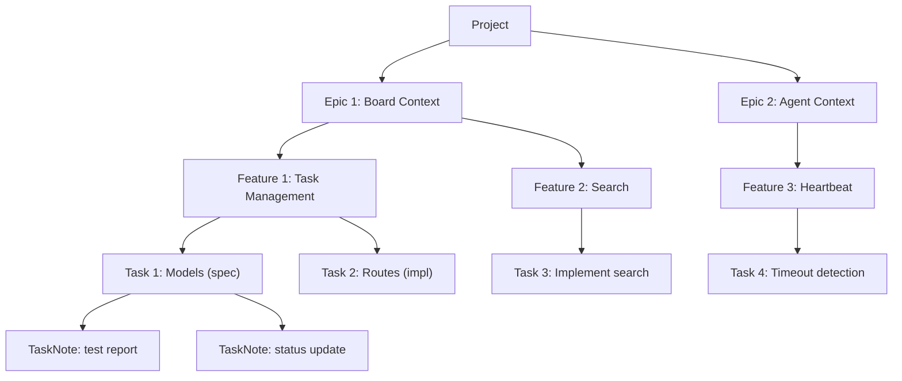

Each entity gets a **human-readable number** (E-1, F-5, T-23) via monotonic counters on the Project. UUIDs handle identity; numbers handle conversation.

### Task Types and the Pipeline

Tasks aren't all equal. The `task_type` field determines pipeline ordering:

| Type | Pipeline Stage | Description |
|------|---------------|-------------|
| `spec` | 0 | Write a design specification |
| `plan` | 1 | Write an implementation plan |
| `impl` | 2 | Implement the feature |
| `task` | -1 (independent) | Generic standalone task |

**Pipeline guards** enforce ordering. You can't start a `plan` task until all `spec` tasks in the same feature are done. You can't start `impl` until all `plan` tasks are done. This is the planning pipeline: **spec -> plan -> implement**.

### Status State Machine

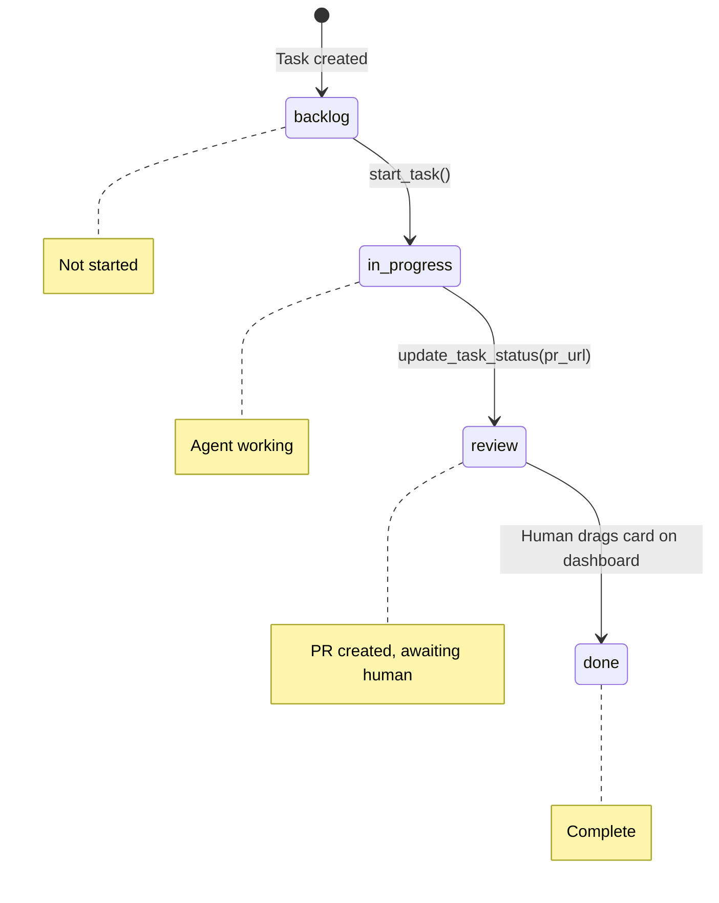

**Key constraint:** Agents can move tasks to `review` but **cannot** move them to `done`. Only humans drag the card to done on the dashboard. This ensures human review of every piece of agent work.

### Status Roll-Up

Feature and epic statuses are **computed**, not set directly:

```python
# Feature status = f(task statuses)
if all tasks done                              -> "done"
elif any task in review                        -> "review"
elif any task in ("in_progress", "prioritized") -> "in_progress"
else                                           -> "planned"

# Epic status = f(feature statuses)
# Same logic, one level up
```

This means the board always reflects reality. No stale "in progress" epics with all-done tasks.

### Feature Dependencies

Features can depend on other features, forming a **directed acyclic graph**:

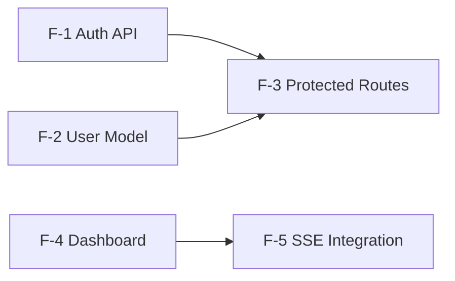

Cycle detection via DFS prevents circular dependencies. The dependency graph is available as a visualization endpoint for the dashboard.

---

## The Agent Lifecycle

This is the heart of cloglog — how autonomous coding agents register, work, communicate, and shut down.

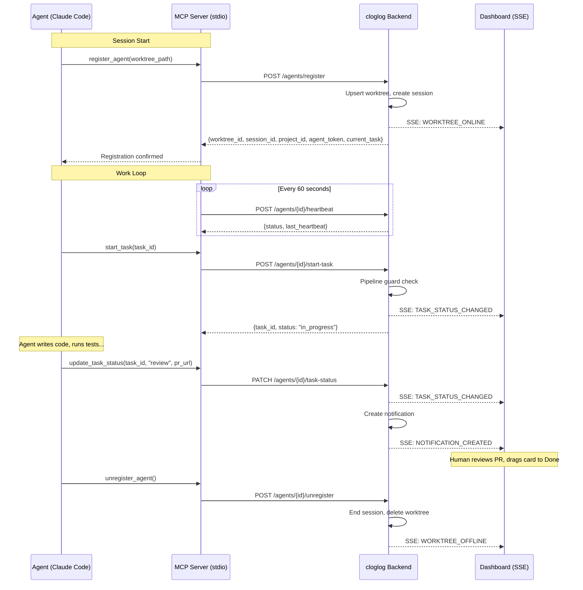

### Registration

When an agent starts in a worktree, it calls `register_agent` with its filesystem path. The backend either creates a new worktree record or reconnects to an existing one (matching on `project_id + worktree_path`). This enables crash recovery — an agent that times out can re-register on the same path and pick up where it left off.

```python
# What happens inside register()
worktree, is_new = await repo.upsert_worktree(project_id, path, branch)
if not is_new:
    # End any stale sessions from previous connection
    old_session = await repo.get_active_session(worktree.id)
    if old_session:
        await repo.end_session(old_session.id, status="ended")

session = await repo.create_session(worktree.id)
# Returns current_task if resuming interrupted work
```

### Heartbeat

The MCP server sends a heartbeat every 60 seconds. The heartbeat response carries one critical signal:

1. **`shutdown_requested`** — the human (or main agent) wants this agent to stop

If an agent's heartbeat goes silent for **180 seconds** (configurable), the backend marks the session as `timed_out` and the worktree as `offline`. A background scheduler checks for timeouts every 60 seconds.

### Three-Tier Shutdown

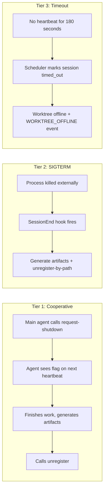

---

## The MCP Server: Agent Gateway

Agents don't talk to the cloglog API directly. They use **MCP tools** (Model Context Protocol) via a stdio-based server that acts as a gateway.

### Why MCP?

Three reasons:

1. **Native tool integration.** Claude Code (and other AI coding tools) natively support MCP. The agent calls `start_task` the same way it calls `Read` or `Edit` — it's part of the tool ecosystem. No curl commands, no HTTP clients, no auth token management.

2. **State machine enforcement.** The MCP server is the chokepoint where pipeline guards run. It enforces that spec tasks finish before plan tasks can start, that PR URLs are required when moving to review, and that agents cannot mark tasks as done. These rules live in the server, not in agent prompts — so they can't be worked around.

3. **Agent-to-agent communication.** The MCP server runs a heartbeat timer that polls the backend every 60 seconds. Pending messages from other agents are drained on each heartbeat and surfaced to the agent through tool responses. This gives agents a communication channel without any extra infrastructure.

### Authentication Flow

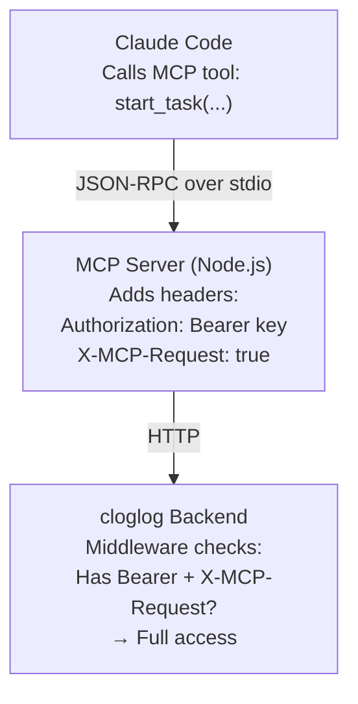

The **`ApiAccessControlMiddleware`** enforces routing before any auth dependency runs:

| Credential | Who | Allowed routes |
|---|---|---|
| `Bearer <key>` + `X-MCP-Request: true` | MCP server (on behalf of any agent) | All routes |
| `Bearer <agent-token>` or `Bearer <project-api-key>` | Agent directly | Only `/api/v1/agents/*` routes |
| `X-Dashboard-Key: <secret>` (or `?dashboard_key=` for SSE/EventSource) | Human dashboard/CLI | All non-agent routes |

Agents receive a per-agent token (`agent_token`) from the registration response. The MCP server stores this token and uses it for heartbeat calls. For board operations (tasks, documents), the MCP server uses its own service key with `X-MCP-Request: true`. A dashboard client implemented without `X-Dashboard-Key` would receive `403 Agents can only access /api/v1/agents/* routes`.

### MCP Tool Reference

The MCP server exposes 28 tools organized by function:

**Agent Lifecycle**
| Tool | Description |
|---|---|
| `register_agent` | Register worktree, start session, begin heartbeat |
| `unregister_agent` | Clean shutdown, stop heartbeat |

**Task Management**
| Tool | Description |
|---|---|
| `get_my_tasks` | List tasks assigned to this worktree |
| `start_task` | Move task to in_progress (with pipeline guards) |
| `assign_task` | Assign a task to a target worktree by ID |
| `complete_task` | BLOCKED — agents cannot mark done |
| `update_task_status` | Move task between columns |
| `add_task_note` | Append status note to a task |
| `report_artifact` | Record artifact path for spec/plan tasks after PR merge |

**Board Operations**
| Tool | Description |
|---|---|
| `get_project` | Get current project info |
| `get_board` | Kanban view — tasks by status column |
| `get_backlog` | Hierarchical tree — epics > features > tasks |
| `get_active_tasks` | Compact list of non-done, non-archived tasks |
| `create_epic` | Create a new epic |
| `list_epics` | List all epics |
| `update_epic` | Edit epic title, description, bounded_context, or status |
| `delete_epic` | Delete an epic and all its children |
| `create_feature` | Create a feature under an epic |
| `list_features` | List features in an epic |
| `update_feature` | Edit feature title, description, or status |
| `delete_feature` | Delete a feature and all its tasks |
| `create_task` | Create a task under a feature |
| `create_tasks` | Bulk import epics/features/tasks |
| `update_task` | Edit task title/description/priority |
| `delete_task` | Remove a task |

**Documents & Dependencies**
| Tool | Description |
|---|---|
| `attach_document` | Read local file, attach to entity on board |
| `add_dependency` | Add a dependency between two features |
| `remove_dependency` | Remove a dependency between two features |

---

## Cross-Agent Communication

The database-based agent message queue (the `agent_messages` table) was dropped in migration `f1a2b3c4d5e6`. Two file-based channels replaced it:

1. **Webhook notifications** (merge, review, CI events): The webhook pipeline appends events to `<worktree_path>/.cloglog/inbox`. Agents tail this file via the `Monitor` tool.
2. **Shutdown requests**: `AgentService.request_shutdown()` appends a shutdown JSON line to the same `<worktree_path>/.cloglog/inbox` file for instant Monitor delivery, and also sets the `shutdown_requested` flag in the database as a fallback.

---

## The Board & Dashboard

The React dashboard is a real-time Kanban board that updates live as agents work.

### Board Layout

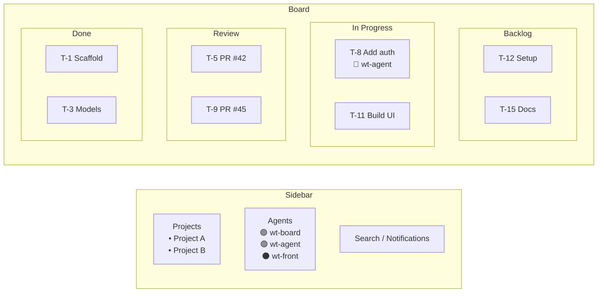

### Real-Time SSE Updates

The dashboard subscribes to a Server-Sent Events stream:

```
GET /api/v1/projects/{project_id}/stream
```

The backend publishes 21 event types through an in-memory EventBus:

```python
class EventBus:
    """Simple in-process pub/sub for SSE fan-out."""

    async def publish(self, event: Event) -> None:
        # Fan out to project-specific subscribers
        for queue in self._subscribers.get(event.project_id, []):
            await queue.put(event)
        # Fan out to global subscribers (notification listener)
        for queue in self._global_subscribers:
            await queue.put(event)
```

When an agent changes a task status, the event flows:

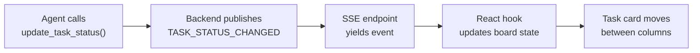

The frontend `useSSE` hook handles 16 event types with targeted state updates:

| Event | Dashboard Action |
|---|---|
| `task_status_changed` | Move task card between columns |
| `worktree_online` / `worktree_offline` | Update agent status indicator |
| `document_attached` | Refresh detail panel |
| `notification_created` | Show notification bell |
| `epic_created` / `epic_deleted` | Refresh backlog tree |
| `feature_created` / `feature_deleted` | Refresh backlog tree |
| `task_created` / `task_deleted` | Refresh backlog tree |
| `task_note_added` | Refresh task detail |
| `dependency_added` / `dependency_removed` | Refresh dependency graph |
| `bulk_import` | Full board refresh |
| `bulk_agents_removed` | Refresh agent list |

### Drag-and-Drop

The board supports drag-and-drop via `@dnd-kit`:

- **Kanban columns**: Drag tasks between status columns (with optimistic UI)
- **Backlog tree**: Reorder epics, features, and tasks within their containers
- **Touch support**: Works on mobile via PointerSensor + TouchSensor

### Notifications

When a task moves to `review`, a background listener creates a notification:

```python
# notification_listener.py runs during app lifespan
async def run_notification_listener():
    queue = event_bus.subscribe_all()
    while True:
        event = await queue.get()
        if event.type == EventType.TASK_STATUS_CHANGED:
            if event.data.get("new_status") == "review":
                # Create DB notification
                # Publish NOTIFICATION_CREATED event
                # Fire desktop notification via notify-send
```

This means you get notified the moment an agent puts up a PR for review — even as a desktop notification if you're on Linux.

---

## Reconciliation

Distributed systems drift. Agents crash, PRs merge without board updates, worktrees get orphaned. The `/reconcile` skill detects and fixes this drift.

### What It Checks

| Check | Drift Type | Fix |
|---|---|---|
| Board tasks in `review` but PR merged | Board behind GitHub | Move task to `done` |
| Worktrees marked `online` with no heartbeat | Stale agent state | Mark offline |
| Git branches with no matching worktree | Orphaned branches | Flag for cleanup |
| Worktree directories that don't exist | Stale DB records | Remove record |
| Tasks assigned to offline worktrees | Abandoned work | Unassign |

Reconciliation is triggered manually via the `/reconcile` command. It's designed to be safe — it reports what it finds and asks for confirmation before fixing.

---

## Infrastructure: Worktree Isolation

Each agent works in complete isolation: its own git branch, its own ports, its own database.

### Worktree Setup

```bash
WORKTREE_PATH=.claude/worktrees/wt-<name> scripts/worktree-infra.sh up
```

This script (invoked by `.cloglog/on-worktree-create.sh` in project-specific setup):

1. Assigns **deterministic ports** by hashing the worktree name
2. Creates an **isolated PostgreSQL database** named `cloglog_wt_<name>`
3. Runs Alembic migrations on the new database
4. Writes a `.env` file with the worktree's port and database URL

The `worktree-create.sh` plugin hook handles agent *registration* only; it delegates infrastructure setup to the project-specific `on-worktree-create.sh` script.

### Port Allocation

```bash
# scripts/worktree-ports.sh
# Deterministic ports from worktree name hash
HASH=$(echo -n "$WORKTREE_NAME" | md5sum | cut -c1-8)
HASH_NUM=$((16#$HASH % 50000 + 10000))

export BACKEND_PORT=$HASH_NUM
export FRONTEND_PORT=$((HASH_NUM + 1))
```

No port conflicts between worktrees. No hardcoded ports. Every worktree gets its own backend, frontend, and database.

### Infrastructure Lifecycle

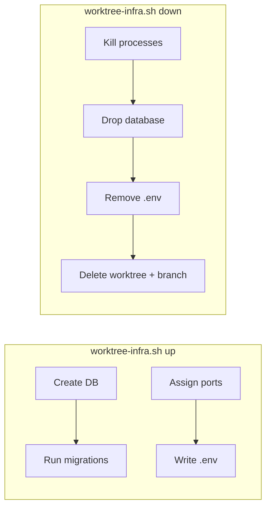

### Bot Identity for PRs

All agent pushes and PR creation use a **GitHub App bot identity**, never the user's personal account. Every PR shows as authored by the bot — which matters because the human needs to be able to review and merge their own agents' work.

---

## Hook-Enforced Discipline

cloglog uses **Claude Code hooks** — shell scripts that run before tool calls — to enforce rules that agents can't bypass.

Hooks live in `plugins/cloglog/hooks/` — part of the cloglog plugin that ships with this repo.

### Active Hooks

| Hook | Trigger | What it enforces |
|---|---|---|
| `protect-worktree-writes.sh` | Any file Edit/Write | Agent can only modify files in its assigned context |
| `quality-gate.sh` | `git commit`, `git push`, `gh pr create` | Must pass `make quality` (lint + typecheck + test + coverage + contract) |
| `prefer-mcp.sh` | `curl`/`wget` to localhost API | Blocks direct API calls, enforces MCP tool use |
| `enforce-task-transitions.sh` | MCP task status updates | Prevents skipping review (must go through review before done) |
| `agent-shutdown.sh` | Session end (SIGTERM) | Generates work logs, calls unregister-by-path |
| `block-sensitive-files.sh` | File Edit/Write | Blocks writes to `.env`, credentials, secrets |
| `require-task-for-pr.sh` | `gh pr create` | Advisory: reminds agent to have an active board task (exits 0, does not block) |
| `remind-pr-update.sh` | After PR creation | Injects reminder to update task status to review |
| `session-bootstrap.sh` | Session start | Loads agent context, checks for inbox messages |
| `worktree-create.sh` | Worktree creation | Registers agent on the board, runs `on-worktree-create.sh` if present |
| `worktree-remove.sh` | Worktree deletion | Cleans up agent registration |

### Worktree Write Protection

The protect-worktree-writes hook reads allowed directories from `.cloglog/config.yaml` under `worktree_scopes`:

```yaml
# .cloglog/config.yaml (simplified)
worktree_scopes:
  board: [src/board/, tests/board/, src/alembic/]
  agent: [src/agent/, tests/agent/, src/alembic/]
  frontend: [frontend/]
  mcp: [mcp-server/]
  e2e: [tests/e2e/]
```

This means an agent working on the Board context literally cannot write to Agent context files. The hook intercepts the tool call and returns an error before the write happens.

---

## Tech Stack

| Layer | Technology | Why |
|---|---|---|
| Backend Framework | **FastAPI** | Async-native, Pydantic integration, OpenAPI generation |
| Database | **PostgreSQL 16** | Reliable, async support via asyncpg, JSONB for metadata |
| ORM | **SQLAlchemy 2.0** (async) | Type-safe queries, relationship loading, Alembic migrations |
| Migrations | **Alembic** | Reliable schema versioning across worktrees |
| Real-time | **SSE Starlette** | Server-Sent Events for dashboard live updates |
| Frontend | **React 18 + Vite** | Fast dev builds, component model, TypeScript |
| Drag-and-Drop | **@dnd-kit** | Accessible, composable DnD primitives |
| MCP Server | **Node.js + @modelcontextprotocol/sdk** | Native MCP support, stdio transport |
| CLI | **Typer + Rich** | Beautiful terminal UI for human operators |
| Package Manager | **uv** | Fast Python dependency resolution |
| Linting | **Ruff** | Fast Python linting and formatting |
| Type Checking | **mypy** (with SQLAlchemy plugin) | Catch type errors in async DB code |
| Testing | **pytest** (backend), **Vitest** (frontend), **Playwright** (E2E) | Full test pyramid |
| API Contract | **OpenAPI YAML** | Single source of truth for API shape |

### Type Safety Pipeline

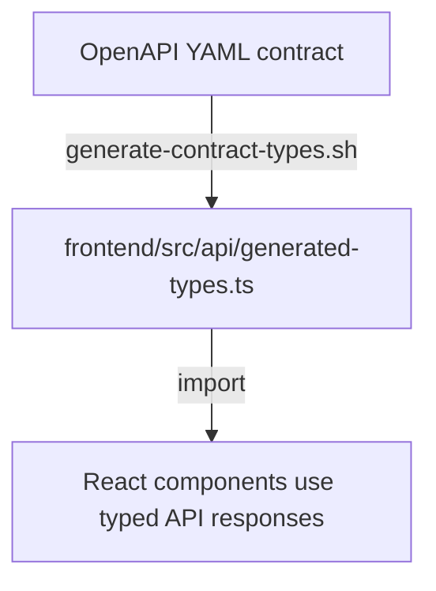

Frontend never hand-writes API types. Backend runs `make contract-check` to verify endpoints match the contract. Drift is caught before commit.

---

## Getting Started

### Prerequisites

- Python 3.12+
- Node.js 20+
- PostgreSQL 16+
- Docker (for easy DB setup)
- [uv](https://github.com/astral-sh/uv) (Python package manager)

### Quick Start

```bash
# Clone the repo
git clone https://github.com/sachinkundu/cloglog.git
cd cloglog

# Install Python dependencies
uv sync --all-extras

# Start PostgreSQL and run migrations
make db-up
make db-migrate

# Start the backend (http://localhost:8000)
make run-backend

# In another terminal, start the frontend (http://localhost:5173)
cd frontend && npm install && npm run dev
```

### Running Tests

```bash
# Full quality gate (lint + typecheck + test + coverage + contract)
make quality

# Individual checks
make test           # All backend tests
make lint           # Ruff linter
make typecheck      # mypy

# Frontend tests (must run from frontend/)
cd frontend && npx vitest run

# MCP server tests
cd mcp-server && make test
```

### See It In Action

1. Open the dashboard at `http://localhost:5173`
2. Create a project
3. Use the CLI to add epics, features, and tasks:
   ```bash
   cloglog projects create "My Project"
   ```
4. Configure the MCP server in your Claude Code settings:
   ```json
   {
     "mcpServers": {
       "cloglog": {
         "command": "node",
         "args": ["./mcp-server/dist/index.js"],
         "env": {
           "CLOGLOG_URL": "http://localhost:8000"
         }
       }
     }
   }
   ```

   The project API key (`CLOGLOG_API_KEY`) MUST NOT live in `.mcp.json` or
   any per-project file — anything inside a project checkout is reachable by
   tooling that bypasses MCP. Place it in `~/.cloglog/credentials` (mode
   `0600`) or export it in the launcher's environment. See
   [`docs/setup-credentials.md`](setup-credentials.md) for the full
   resolution order and the operator one-liner.
5. Start Claude Code in a worktree — it registers automatically and begins working tasks from the board

---

## Glossary

For the full ubiquitous language glossary, see [`docs/ddd-context-map.md`](ddd-context-map.md).

---

*cloglog is built by agents, for agents — and the humans who orchestrate them.*
