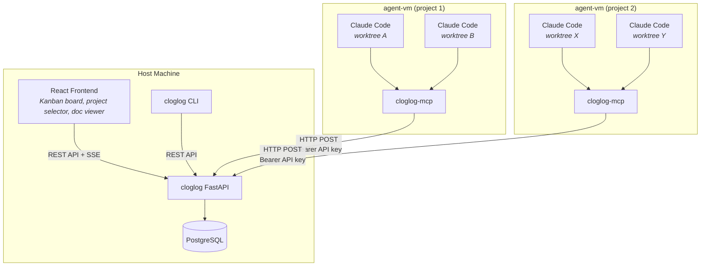
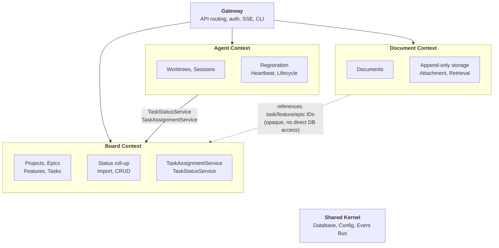
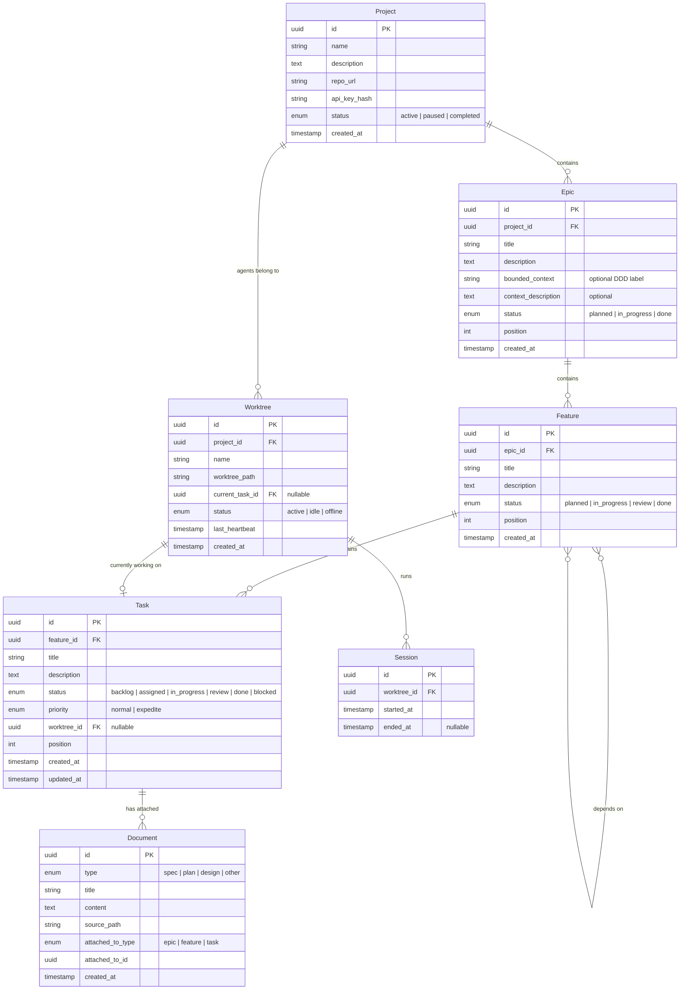
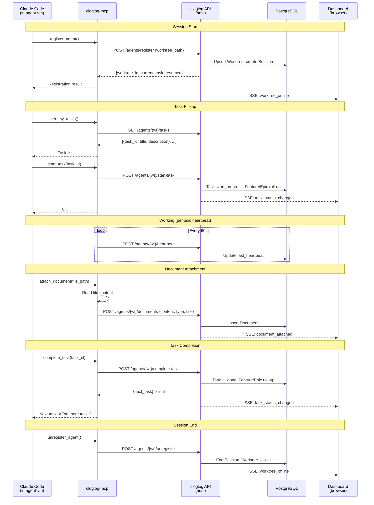
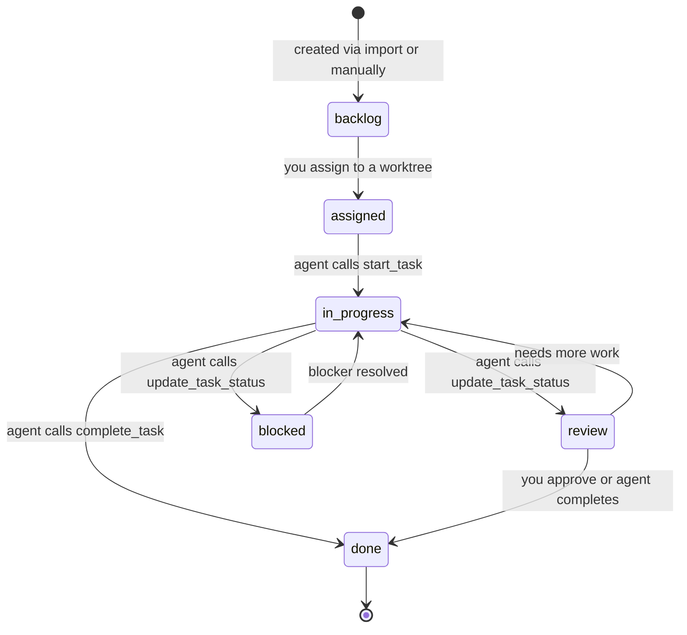
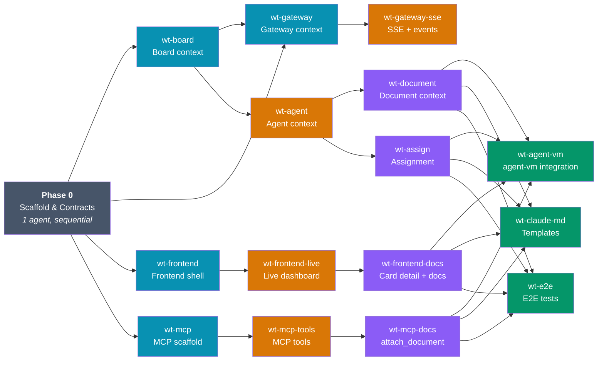

# cloglog — Multi-Project Agent Dashboard

**Date:** 2026-03-31
**Status:** Design

## Overview

cloglog is a Kanban-style dashboard for managing autonomous AI coding agents running inside agent-vm sandboxes. It provides a single place to see all projects, which agents (worktrees) are active, what tasks they're working on, and the full history of design artifacts behind each task.

The system has three parts:
1. **cloglog service** — FastAPI backend + PostgreSQL, runs on the host machine
2. **cloglog frontend** — React SPA, served by the backend or standalone
3. **cloglog-mcp** — lightweight MCP server installed inside agent-vm base image, gives agents tools to report status and attach documents

## Architecture



Agents inside agent-vm sandboxes communicate with the cloglog service via HTTP. The MCP server reads `CLOGLOG_URL` and `CLOGLOG_API_KEY` from environment variables. agent-vm's networking allows VMs to reach the host.

## Domain-Driven Design

The backend is organized into bounded contexts. Each context owns its models, services, repository layer, and API routes. Contexts communicate through explicit interfaces (Python protocols/abstract classes), never by reaching into each other's internals or database tables directly.

### Bounded Contexts

| Context | Responsibility | Directory | Owns Tables |
|---------|---------------|-----------|-------------|
| **Board** | Projects, Epics, Features, Tasks, status roll-up, import, priority | `src/board/` | projects, epics, features, feature_dependencies, tasks |
| **Agent** | Worktrees, Sessions, registration, heartbeat, task lifecycle (pick, start, complete) | `src/agent/` | worktrees, sessions |
| **Document** | Document storage, attachment, retrieval | `src/document/` | documents |
| **Gateway** | API routing, auth middleware, SSE fan-out, CLI interface | `src/gateway/` | (none — orchestrates other contexts) |

### Context Interfaces

Contexts interact through defined service interfaces:

- **Board → Agent**: Board exposes `TaskAssignmentService` so Agent context can claim/release tasks
- **Agent → Board**: Agent context calls Board's `TaskStatusService` to move tasks between columns, which triggers roll-up recomputation
- **Document → Board**: Document context references Board's task/feature/epic IDs but does not query Board tables — it stores `attached_to_type` + `attached_to_id` as opaque references
- **Gateway → All**: Gateway imports route handlers from each context and composes them into the FastAPI app. Auth middleware lives in Gateway.

### Context Map



## Project Layout

```
cloglog/
├── src/
│   ├── board/                  # Board bounded context
│   │   ├── models.py           # SQLAlchemy models: Project, Epic, Feature, Task
│   │   ├── schemas.py          # Pydantic schemas
│   │   ├── repository.py       # DB queries
│   │   ├── services.py         # Business logic, roll-up, import
│   │   ├── routes.py           # FastAPI routes
│   │   └── interfaces.py       # Protocols exposed to other contexts
│   ├── agent/                  # Agent bounded context
│   │   ├── models.py           # Worktree, Session
│   │   ├── schemas.py
│   │   ├── repository.py
│   │   ├── services.py         # Registration, heartbeat, task lifecycle
│   │   └── routes.py
│   ├── document/               # Document bounded context
│   │   ├── models.py           # Document
│   │   ├── schemas.py
│   │   ├── repository.py
│   │   ├── services.py
│   │   └── routes.py
│   ├── gateway/                # Gateway context
│   │   ├── app.py              # FastAPI app composition
│   │   ├── auth.py             # API key middleware
│   │   ├── sse.py              # SSE fan-out
│   │   └── cli.py              # CLI tool (cloglog command)
│   ├── shared/                 # Shared kernel (minimal)
│   │   ├── database.py         # DB engine, session factory
│   │   ├── config.py           # Settings (env-based)
│   │   └── events.py           # Internal event bus for SSE
│   └── alembic/                # DB migrations
│       └── versions/
├── tests/
│   ├── board/                  # Board context tests
│   ├── agent/                  # Agent context tests
│   ├── document/               # Document context tests
│   ├── gateway/                # Gateway + integration tests
│   ├── e2e/                    # End-to-end tests
│   └── conftest.py             # Shared fixtures (test DB, client)
├── frontend/                   # React SPA (separate package)
│   ├── src/
│   │   ├── components/
│   │   ├── hooks/
│   │   ├── api/
│   │   └── theme/
│   └── tests/
├── mcp-server/                 # cloglog-mcp (Node.js, separate package)
│   ├── src/
│   └── tests/
├── pyproject.toml              # Backend dependencies + test config
├── Makefile                    # Test runners, quality checks
└── docs/
    └── superpowers/specs/
```

### Worktree Compatibility

Each bounded context and each top-level package (frontend, mcp-server) maps to a separate worktree. Agents in different worktrees touch different directories, avoiding merge conflicts:

| Worktree | Works in | Never touches |
|----------|----------|---------------|
| `wt-board` | `src/board/`, `tests/board/` | Other contexts, frontend, mcp-server |
| `wt-agent` | `src/agent/`, `tests/agent/` | Other contexts, frontend, mcp-server |
| `wt-document` | `src/document/`, `tests/document/` | Other contexts, frontend, mcp-server |
| `wt-gateway` | `src/gateway/`, `tests/gateway/` | Other contexts, frontend, mcp-server |
| `wt-frontend` | `frontend/` | Backend, mcp-server |
| `wt-mcp` | `mcp-server/` | Backend, frontend |

The **shared kernel** (`src/shared/`) is set up in Phase 0 and rarely changes after that. If it does need changes, one agent makes the change and others rebase.

**Interface contracts** (`interfaces.py` in each context) are also defined in Phase 0. These are the "API" between contexts — Python Protocols that define what each context exposes. Agents code against these interfaces, so their implementations don't conflict.

## Test Infrastructure

Test infrastructure is set up in Phase 0, before any feature work begins. Every agent in every worktree can run tests for their context independently.

### User-Level Features & BDD Specs

The following BDD specs define the system's behavior from the user's perspective. All implementation must satisfy these specs.

#### Feature: Project Management

```gherkin
Feature: Project management
  As a project manager
  I want to create and view projects on the dashboard
  So that I can track all my repositories in one place

  Scenario: Create a new project
    Given the cloglog service is running
    When I create a project named "my-app" via the CLI
    Then a project "my-app" appears in the dashboard sidebar
    And an API key is returned for agent authentication

  Scenario: View project status
    Given a project "my-app" exists with 3 active worktrees and 10 tasks
    When I open the dashboard
    Then the sidebar shows "my-app" with a green status indicator
    And the sidebar shows "3 agents · 4/10 done"
```

#### Feature: Plan Import & Board Population

```gherkin
Feature: Plan import and board population
  As a project manager
  I want to import a structured plan onto the board
  So that agents can start working on defined tasks

  Scenario: Import a plan from brainstorming
    Given a project "my-app" exists
    When I import a plan with 2 epics, 4 features, and 8 tasks
    Then all 8 tasks appear in the "Backlog" column
    And each task shows its epic/feature breadcrumb
    And the board header shows "8 tasks, 0 active, 0% done"

  Scenario: Agent creates tasks after brainstorming
    Given I am in a terminal session with an agent
    And we have brainstormed a feature design together
    When the agent calls create_tasks with the agreed breakdown
    Then the tasks appear on the board in "Backlog"
    And each task has the spec and plan documents attached
```

#### Feature: Agent Task Lifecycle

```gherkin
Feature: Agent task lifecycle
  As an autonomous agent
  I want to register, pick up tasks, and report progress
  So that the dashboard reflects my current work

  Scenario: Agent registers and resumes work
    Given a worktree "wt-auth" previously worked on task "Implement OAuth"
    And the task is in "In Progress"
    When a new session starts in worktree "wt-auth"
    And the agent calls register_agent
    Then the agent receives its worktree ID and current task
    And the dashboard shows "wt-auth" as active

  Scenario: Agent completes a task and picks up the next
    Given agent "wt-auth" is working on task "Implement OAuth"
    When the agent calls complete_task
    Then task "Implement OAuth" moves to "Done" on the board
    And the feature status rolls up (if all tasks done, feature is done)
    And the agent receives the next assigned task

  Scenario: Agent goes offline
    Given agent "wt-auth" is active with a running heartbeat
    When the heartbeat stops for 3 minutes
    Then the dashboard shows "wt-auth" as offline
    And the task remains in its current column (not reverted)

  Scenario: Agent attaches a design document
    Given agent "wt-auth" is working on task "Implement OAuth"
    When the agent generates a spec and calls attach_document
    Then a "spec" chip appears on the task card in the dashboard
    And clicking the chip shows the full document content
```

#### Feature: Collaborative Brainstorming to Board

```gherkin
Feature: Collaborative brainstorming to board
  As a project manager working with an agent in a terminal
  I want our brainstorming results to flow onto the board
  So that design decisions become trackable work items

  Scenario: Brainstorm a feature and create tasks
    Given I am in a terminal with an agent on project "my-app"
    When I say "let's design the auth system"
    And we brainstorm the design together
    And I approve the proposed task breakdown
    Then the agent creates an epic "Auth System" on the board
    And creates features and tasks under it
    And attaches the spec and design documents to relevant items

  Scenario: Review and refine agent-created tasks
    Given an agent has created 5 tasks from our brainstorming session
    When I open the dashboard and review the tasks
    Then I can delete tasks that are too granular
    And I can edit task descriptions for clarity
    And I can reprioritize by dragging between positions
```

#### Feature: Real-Time Dashboard

```gherkin
Feature: Real-time dashboard updates
  As a project manager
  I want the dashboard to update in real-time
  So that I can see agent activity without refreshing

  Scenario: Task status changes appear live
    Given I have the dashboard open for project "my-app"
    When an agent moves a task from "In Progress" to "Review"
    Then the card moves to the "Review" column without page refresh
    And the board stats update to reflect the change

  Scenario: New agent comes online
    Given I have the dashboard open
    When a new agent session starts in worktree "wt-api"
    Then "wt-api" appears in the agent roster with a pulse indicator
```

#### Feature: Document Trail

```gherkin
Feature: Document audit trail
  As a project manager
  I want to see all design artifacts attached to tasks
  So that I can understand the history behind each piece of work

  Scenario: View documents on a task card
    Given a task has a spec, plan, and design document attached
    When I view the task on the board
    Then I see three colored chips: "spec", "plan", "design"
    And clicking a chip opens the full markdown content

  Scenario: Documents are append-only
    Given a task has a spec document attached
    When the agent generates a revised spec
    Then a new document entry is created (not overwriting the old one)
    And both versions are visible in the task detail view
```

### Backend Testing

- **Framework**: pytest
- **Database**: Each test run gets a fresh PostgreSQL database (via `pytest-postgresql` or Docker)
- **Coverage**: pytest-cov with enforced minimum threshold (starts at 80%, increases as project matures)
- **Fixtures**: Shared in `tests/conftest.py` — test DB session, API test client, factory functions for creating test data

```bash
# Run all tests
make test

# Run tests for a specific context (what agents do in their worktree)
make test-board          # pytest tests/board/
make test-agent          # pytest tests/agent/
make test-document       # pytest tests/document/
make test-gateway        # pytest tests/gateway/
make test-e2e            # pytest tests/e2e/

# Coverage report
make coverage            # Generates HTML coverage report

# Quality checks
make lint                # ruff check + ruff format --check
make typecheck           # mypy src/
make quality             # lint + typecheck + test + coverage
```

### Frontend Testing

- **Framework**: Vitest + React Testing Library
- **Coverage**: v8 coverage via Vitest

```bash
cd frontend
make test                # vitest run
make coverage            # vitest run --coverage
```

### MCP Server Testing

- **Framework**: Jest or Vitest (Node.js)
- **Mock server**: Tests run against a mock HTTP backend to verify MCP tools produce correct API calls

```bash
cd mcp-server
make test
```

### Quality Gate

Before an agent can mark a task as complete or create a PR, it must run `make quality` and verify all checks pass. The output is printed to the terminal:

```
$ make quality
── Backend ─────────────────────────────
  Tests:    142 passed, 0 failed
  Coverage: 87.3% (min: 80%)  ✓
  Lint:     0 errors           ✓
  Types:    0 errors           ✓
── Frontend ────────────────────────────
  Tests:    38 passed, 0 failed
  Coverage: 82.1% (min: 80%)  ✓
── MCP Server ──────────────────────────
  Tests:    21 passed, 0 failed
  Coverage: 91.0% (min: 80%)  ✓
── Quality gate: PASSED ────────────────
```

If any check fails, the agent must fix the issue before proceeding. This is enforced in the agent's CLAUDE.md instructions — `make quality` is a mandatory pre-completion step.

## Data Model

### Entity Relationship Diagram



### Agent Task Lifecycle



### Detailed Entity Descriptions

### Project

Top-level entity. Maps 1:1 to a source code repository and an agent-vm instance.

| Field | Type | Description |
|-------|------|-------------|
| id | UUID | Primary key |
| name | string | Project name (e.g., "cloglog") |
| description | text | Optional project description |
| repo_url | string | Optional repository URL |
| api_key_hash | string | Hashed API key for agent auth |
| status | enum | active / paused / completed |
| created_at | timestamp | |

### Epic

Large initiative, optionally maps to a DDD Bounded Context.

| Field | Type | Description |
|-------|------|-------------|
| id | UUID | Primary key |
| project_id | FK → Project | Parent project |
| title | string | Epic name |
| description | text | |
| bounded_context | string | Optional DDD Bounded Context label |
| context_description | text | Optional ubiquitous language / domain boundaries |
| status | enum | planned / in_progress / done |
| position | int | Display order |
| created_at | timestamp | |

Status is a cached roll-up, recomputed whenever a child Feature's status changes: all features done → epic done, any feature in_progress → epic in_progress, otherwise planned.

### Feature

Deliverable unit of work under an Epic.

| Field | Type | Description |
|-------|------|-------------|
| id | UUID | Primary key |
| epic_id | FK → Epic | Parent epic |
| title | string | Feature name |
| description | text | |
| status | enum | planned / in_progress / review / done |
| position | int | Display order within epic |
| created_at | timestamp | |

Status is a cached roll-up, recomputed whenever a child Task's status changes: all tasks done → feature done, any task in review → feature in review, any task in_progress → feature in_progress, otherwise planned.

### Feature Dependency

Optional dependency between Features to help avoid merge conflicts and sequence work.

| Field | Type | Description |
|-------|------|-------------|
| feature_id | FK → Feature | The dependent feature |
| depends_on_id | FK → Feature | The feature it depends on |

### Task

Agent-sized work unit. This is what appears as a card on the Kanban board.

| Field | Type | Description |
|-------|------|-------------|
| id | UUID | Primary key |
| feature_id | FK → Feature | Parent feature |
| title | string | Task name |
| description | text | What needs to be done |
| status | enum | backlog / assigned / in_progress / review / done / blocked |
| priority | enum | normal / expedite |
| worktree_id | FK → Worktree | Assigned worktree (nullable) |
| position | int | Display order within column |
| created_at | timestamp | |
| updated_at | timestamp | |

#### Task Status Flow



### Worktree

Persistent agent identity. Tied to a git worktree path inside a VM. Survives session restarts.

| Field | Type | Description |
|-------|------|-------------|
| id | UUID | Primary key |
| project_id | FK → Project | Parent project (immutable) |
| name | string | Derived from worktree path |
| worktree_path | string | Path inside the VM |
| current_task_id | FK → Task | Currently active task (nullable) |
| status | enum | active / idle / offline |
| last_heartbeat | timestamp | Last time a session checked in |
| created_at | timestamp | |

Agents are scoped to a project and never work across projects. Identity is determined by `project_id + worktree_path` — if a session registers with a known worktree path, it reconnects to the existing Worktree record.

### Session

Ephemeral record of a single Claude Code terminal run within a worktree.

| Field | Type | Description |
|-------|------|-------------|
| id | UUID | Primary key |
| worktree_id | FK → Worktree | Parent worktree |
| started_at | timestamp | |
| ended_at | timestamp | Nullable, set on unregister or heartbeat timeout |

### Document

Append-only audit trail. Stores the actual content of specs, plans, and design docs generated during brainstorming and agent work. Documents are write-once — never edited through the board.

| Field | Type | Description |
|-------|------|-------------|
| id | UUID | Primary key |
| type | enum | spec / plan / design / other |
| title | string | Document title |
| content | text | Full markdown content |
| source_path | string | Original file path inside VM (reference only) |
| attached_to_type | enum | epic / feature / task |
| attached_to_id | UUID | Polymorphic FK |
| created_at | timestamp | |

## API Design

Auth: `Authorization: Bearer <project-api-key>` header on all agent-facing endpoints.

### Agent-Facing Endpoints (Write Path)

```
POST   /api/v1/agents/register
       Body: { worktree_path }
       Returns: { worktree_id, name, current_task, resumed: bool }
       Upserts worktree, creates session.

POST   /api/v1/agents/{worktree_id}/heartbeat
       Periodic liveness ping. Updates last_heartbeat.

GET    /api/v1/agents/{worktree_id}/tasks
       Returns ordered list of tasks assigned to this worktree.

POST   /api/v1/agents/{worktree_id}/start-task
       Body: { task_id }
       Moves task to in_progress, sets worktree.current_task.

POST   /api/v1/agents/{worktree_id}/complete-task
       Body: { task_id }
       Moves task to done, clears current_task, returns next task if available.

PATCH  /api/v1/agents/{worktree_id}/task-status
       Body: { task_id, status }
       Move task to a specific column (e.g., review).

POST   /api/v1/agents/{worktree_id}/task-note
       Body: { task_id, note }
       Append a brief status note.

POST   /api/v1/agents/{worktree_id}/documents
       Body: { task_id, type, title, content, source_path }
       Attach a document to a task.

POST   /api/v1/agents/{worktree_id}/unregister
       Ends the current session, sets worktree to idle.
```

### Dashboard-Facing Endpoints (Read Path)

```
GET    /api/v1/projects
       List all projects with summary stats.

GET    /api/v1/projects/{id}
       Project detail.

GET    /api/v1/projects/{id}/board
       Full Kanban board: tasks grouped by column, with worktree and document info.

GET    /api/v1/projects/{id}/epics
       Epics with roll-up status.

GET    /api/v1/projects/{id}/epics/{id}/features
       Features under an epic with roll-up status.

GET    /api/v1/projects/{id}/worktrees
       Active worktrees and their current tasks.

GET    /api/v1/tasks/{id}/documents
       List documents attached to a task.

GET    /api/v1/documents/{id}
       Full document content.

GET    /api/v1/projects/{id}/stream
       SSE endpoint for real-time board updates.
```

### Management Endpoints (Your Actions)

```
POST   /api/v1/projects
       Create project, generates API key.
       Returns: { project, api_key } (key shown once, stored hashed)

POST   /api/v1/projects/{id}/epics
POST   /api/v1/projects/{id}/epics/{id}/features
POST   /api/v1/projects/{id}/features/{id}/tasks
       Create individual items.

POST   /api/v1/projects/{id}/import
       Bulk import epics/features/tasks from a structured plan.
       Body: { epics: [{ title, features: [{ title, tasks: [...] }] }] }
       This is the brainstorming → board bridge.

PATCH  /api/v1/tasks/{id}
       Edit task (reprioritize, reassign worktree, change status).

DELETE /api/v1/tasks/{id}
       Remove a task (quality gate).

POST   /api/v1/worktrees/{id}/assign
       Assign a specific task to a worktree.
```

### CLI Tool

A `cloglog` CLI on the host for quick management:

```bash
cloglog projects                          # List projects
cloglog board <project>                   # Show board in terminal
cloglog assign <project> <worktree> <task> # Assign task
cloglog import <project> <file.json>      # Import plan
cloglog worktrees <project>               # List worktrees
```

## MCP Server (cloglog-mcp)

Installed in the agent-vm base image during `agent-vm setup`. Configured in `~/.claude.json` inside the VM.

### Installation

Added to `agent-vm.setup.sh`:
```bash
npm install -g cloglog-mcp
```

Added to `~/.claude.json` inside the VM:
```json
{
  "mcpServers": {
    "cloglog": {
      "command": "cloglog-mcp",
      "env": {
        "CLOGLOG_URL": "${CLOGLOG_URL}",
        "CLOGLOG_API_KEY": "${CLOGLOG_API_KEY}"
      }
    }
  }
}
```

### Environment Variables

Set via `.agent-vm.runtime.sh` per project, or via `~/.agent-vm/runtime.sh` globally:

```bash
export CLOGLOG_URL="http://<host-ip>:8000"
export CLOGLOG_API_KEY="$(cat /credentials/cloglog-api-key)"
```

The API key file lives in `~/.agent-vm/credentials/cloglog-api-key` on the host, mounted read-only at `/credentials` inside the VM.

### MCP Tools

| Tool | Description |
|------|-------------|
| `register_agent` | Register this worktree with cloglog. Called at session start. Returns current task if resuming. |
| `get_my_tasks` | Get ordered list of assigned tasks. |
| `start_task` | Mark a task as In Progress. |
| `complete_task` | Mark task as Done, get next task. |
| `update_task_status` | Move task to a specific column. |
| `add_task_note` | Append a status note to current task. |
| `attach_document` | Read a local file and POST its content to cloglog as a document attachment. |
| `create_tasks` | Create epics/features/tasks on the board from a structured breakdown (used after brainstorming). |
| `unregister_agent` | Sign off cleanly when session ends. |

### Agent Instructions (CLAUDE.md)

Each project's CLAUDE.md includes:

```markdown
## Task Management

You have cloglog tools for managing work on the board.

### When brainstorming with the user

If the user asks you to brainstorm, design, or plan a feature:
1. Call `register_agent` if you haven't already.
2. Brainstorm and design together in the terminal as normal.
3. Once the user approves the task breakdown, call `create_tasks` to add
   epics/features/tasks to the board.
4. Call `attach_document` to link specs, plans, and design docs to the
   relevant board items.
5. Begin execution or wait for further instructions.

### When executing assigned tasks

1. At session start, call `register_agent` to identify yourself.
2. Call `get_my_tasks` to see your assigned work.
3. Before starting work, call `start_task` with the task ID.
4. When you generate specs, plans, or design docs, call `attach_document`.
5. Before completing a task, run `make quality` and verify all checks pass.
6. When done, call `complete_task` — it returns your next task.
7. If no more tasks, your work is done for this session.
```

## Frontend

### Tech Stack

- React (Vite)
- Dark and light themes (CSS variables, toggle in sidebar header)
- SSE for real-time updates from the backend

### Layout

Sidebar + Board (Layout A):

- **Sidebar**: Project list with status dots (active/idle pulse animation), agent roster showing worktrees for selected project with current task labels
- **Board header**: Project name, summary stats (total tasks, active worktrees, % done)
- **Kanban columns**: Backlog → Assigned → In Progress → Review → Done
- **Task cards**: Epic/feature breadcrumb, task title, document chips (spec/plan/design — colored, clickable), assigned worktree with status indicator
- **Card detail view**: Full task description, complete document list with content viewer, task history/notes, worktree assignment

### Design Language

- Typography: Bricolage Grotesque (display), DM Sans (body), IBM Plex Mono (technical/data)
- Dark theme: deep blue-black base (#06080d), cyan accent (#22d3ee), emerald active, amber working, purple review
- Light theme: warm whites, teal accent (#0891b2), adjusted contrast
- Active worktrees have pulse animations on status indicators
- Cards lift on hover with subtle shadow
- Document chips are color-coded by type

## agent-vm Integration Points

### Base Image Setup (`agent-vm.setup.sh`)

- Install `cloglog-mcp` npm package
- Configure `~/.claude.json` with the cloglog MCP server entry

### Credentials (`~/.agent-vm/credentials/`)

- `cloglog-api-key` — project API key, mounted read-only at `/credentials`

### Per-Project Runtime (`.agent-vm.runtime.sh`)

- Set `CLOGLOG_URL` environment variable pointing to the host
- Set `CLOGLOG_API_KEY` from the credentials mount
- Optionally set `CLOGLOG_PROJECT` if needed for identification

### Agent Workflow

1. `agent-vm claude` starts a VM and launches Claude Code
2. Runtime script sets cloglog environment variables
3. Claude Code loads cloglog-mcp from its MCP config
4. Agent calls `register_agent` — worktree identity established or resumed
5. Agent calls `get_my_tasks` — gets its task list
6. Agent works through tasks sequentially, reporting status via MCP tools
7. Agent attaches any generated documents (specs, plans, designs)
8. On session end (context full, task complete, or exit), agent calls `unregister_agent`
9. If restarted in the same worktree, `register_agent` reconnects to existing identity

## Task Board Population

### From Brainstorming

When you brainstorm a project (using this skill or similar), the resulting spec and implementation plan produce a structured breakdown of epics, features, and tasks. This breakdown is posted to cloglog via:

```
POST /api/v1/projects/{id}/import
```

The import creates all items on the board in `backlog` status. You review them on the dashboard, delete anything that's junk, reprioritize, and assign tasks to worktrees. Only then do agents start picking up work.

### From Agent Work

Agents create tasks on the board in two scenarios:

1. **After brainstorming with you**: You discuss a feature in the terminal, agree on the breakdown, and the agent calls `create_tasks` to populate the board. The approval happens in the terminal conversation — you see the proposed breakdown and say yes before it hits the board.

2. **During implementation**: If an agent discovers work that needs its own task (e.g., a prerequisite it didn't anticipate), it can create tasks and flag them for your review. You can review, edit, or delete these on the dashboard.

The MCP server exposes a `create_tasks` tool for this:

```
POST /api/v1/projects/{id}/tasks/create
Body: { epic: { title, features: [{ title, tasks: [...] }] } }
```

This is the same as the `/import` endpoint but available to agents via MCP.

## Heartbeat & Offline Detection

Worktrees send a heartbeat every 60 seconds via the MCP server. If no heartbeat is received for 3 minutes, the dashboard marks the worktree as offline. The task remains in its current column — it doesn't automatically revert to backlog.

This handles:
- Terminal crashes
- VM restarts
- Network interruptions

When the session restarts and calls `register_agent`, the worktree goes back to active with its task intact.

## Testing Strategy

### Principles

- **Test-first**: Write testable specs before implementation. Code must satisfy the specs.
- **Never assume it works**: Every layer must be verified with the appropriate level of testing.
- **User testing checkpoints**: At the end of each phase, stop and provide precise manual testing instructions.

### Worktree Test Isolation

Multiple agents work in separate git worktrees simultaneously. Their test runs must not interfere with each other.

**Database isolation**: Each test run creates a unique temporary PostgreSQL database named with a random suffix (e.g., `cloglog_test_a3f8b2`). The database is created at the start of the test session and dropped at the end. Two agents running tests at the same time get completely separate databases. This is handled in `tests/conftest.py` via a session-scoped fixture.

**Port isolation**: If tests need to start a test server (e.g., for e2e tests), they bind to port 0 (OS-assigned random port). No hardcoded ports.

**File isolation**: Each worktree has its own working directory. Tests that write temp files use `tmp_path` (pytest fixture) which is unique per test. No tests write to shared locations.

**Migration isolation**: Each test database runs migrations independently. Worktrees may have different migration states if one agent is ahead — this is fine because each has its own database.

**What is shared**: The PostgreSQL server process itself (running via Docker Compose). All worktrees connect to the same PostgreSQL instance but use different databases within it. This is set up once and reused.

**Makefile per-context targets**: Each worktree only runs its own context's tests. `make test-board` runs `pytest tests/board/` — it doesn't touch other contexts' tests, so there's no cross-worktree test interference even at the file level.

### Test Layers

**Unit tests** — for all business logic in isolation:
- Status roll-up computation (task → feature → epic)
- API key hashing and validation
- Heartbeat timeout detection
- Task assignment rules (can't assign to offline worktree, can't assign already-assigned task)
- Import payload parsing and validation

**Integration tests** — for API endpoints against a real PostgreSQL database:
- Full CRUD lifecycle for projects, epics, features, tasks
- Agent registration, task pickup, status update, completion flow
- Bulk import endpoint with nested hierarchy
- SSE event delivery when task status changes
- API key auth (valid key, invalid key, wrong project key)
- Worktree reconnection after session restart

**MCP server tests** — for the cloglog-mcp tool layer:
- Each MCP tool correctly maps to the right API call
- File reading + content posting for `attach_document`
- Error handling when cloglog service is unreachable
- Heartbeat timer starts on register, stops on unregister

**Frontend tests** — for the React dashboard:
- Component rendering (board, cards, sidebar, document viewer)
- Real-time updates via SSE (mock SSE source, verify board re-renders)
- Theme switching
- Project selection and board loading

**End-to-end tests** — full stack verification per phase:
- Agent registers → picks task → updates status → completes task → dashboard reflects all changes
- Import plan → tasks appear on board → assign to worktree → agent picks up
- Document attachment from agent → visible on dashboard card

### User Testing Checkpoints

At the end of each phase, work stops and the user receives:
1. What was built in this phase
2. How to start the relevant services
3. Exact steps to test (URLs to visit, API calls to make, what to verify)
4. Expected outcomes for each step
5. Known limitations at this phase

## Implementation Phases

The project is built in vertical slices. Each phase delivers a working, testable increment. Work is organized by DDD bounded context so each agent works in its own worktree touching only its own directories, eliminating merge conflicts.

This project itself is developed inside agent-vm. Each worktree below maps to an actual git worktree in the cloglog repo, with an agent running inside the VM.

### Phase Dependency & Parallelism Map



### Phase 0: Scaffold & Contracts (Sequential — single agent, main branch)

Before parallel work begins, one agent sets up the project skeleton and defines all interface contracts. This is the shared foundation that all worktrees build on.

**Work:**
- Initialize Python project (`pyproject.toml`, `uv`/`poetry`, ruff, mypy config)
- Initialize React project in `frontend/` (Vite, TypeScript, Vitest)
- Initialize MCP server in `mcp-server/` (Node.js/TypeScript, Jest/Vitest)
- Create `src/` directory structure for all bounded contexts (empty `__init__.py` files, module boundaries)
- Define `src/board/interfaces.py` — `TaskAssignmentService`, `TaskStatusService` protocols
- Define `src/agent/interfaces.py` — protocols exposed by Agent context
- Define `src/document/interfaces.py` — protocols exposed by Document context
- Set up `src/shared/` — database engine, config, event bus stubs
- Set up Alembic for migrations
- Set up `tests/conftest.py` with PostgreSQL test fixtures
- Create `Makefile` with all test/lint/quality targets
- Create `docker-compose.yml` for PostgreSQL (dev + test)
- Create sample test in each context to verify the test runner works
- Write `CLAUDE.md` for this repo with bounded context rules and worktree discipline

**Tests:** `make quality` passes — lint clean, type check clean, all sample tests pass, coverage reporting works.

**User test:** Run `make quality` and verify green. Run `docker compose up -d` and verify PostgreSQL is accessible.

### Phase 1: Board Context + Frontend Shell + MCP Scaffold

Vertical slice: Create a project, import a plan, see the Kanban board.

| Worktree | Agent | Context | Works in | Work |
|----------|-------|---------|----------|------|
| `wt-board` | Agent A | Board | `src/board/`, `tests/board/`, `src/alembic/` | Project, Epic, Feature, Task models. Migrations. Repository layer. Services: CRUD, `/import` bulk, status roll-up. Routes for all management + dashboard-read endpoints. API key generation and hashing. Unit tests for roll-up logic, import parsing. Integration tests for all endpoints. |
| `wt-gateway` | Agent B | Gateway | `src/gateway/`, `tests/gateway/` | FastAPI app composition, auth middleware (API key validation), CORS, error handling. Integration tests for auth (valid/invalid/wrong-project keys). CLI tool scaffold: `cloglog projects`, `cloglog import`, `cloglog board`. |
| `wt-frontend` | Agent C | Frontend | `frontend/` | React app scaffold. Theme system (CSS variables, dark/light toggle). Sidebar: project list component, connected to `GET /projects` API. Kanban board component: columns, task cards with epic/feature breadcrumb, board header with stats. Connected to `GET /projects/{id}/board`. Component tests for board, cards, sidebar. |
| `wt-mcp` | Agent D | MCP | `mcp-server/` | Node.js MCP server scaffold. HTTP client for cloglog API. `register_agent` tool implemented. Tests against mock HTTP server. |

**Merge order:** wt-board first (creates tables), then wt-gateway (depends on board routes), then wt-frontend and wt-mcp (independent).

**Integration test after merge:** Import a plan via curl → board endpoint returns correct data → frontend renders it.

**User test:**
1. `docker compose up -d` (PostgreSQL)
2. `make run-backend` (FastAPI on :8000)
3. `curl -X POST localhost:8000/api/v1/projects -d '{"name": "test-project"}' ` → get project ID + API key
4. `curl -X POST localhost:8000/api/v1/projects/{id}/import -H "Authorization: Bearer <key>" -d @sample-plan.json` → 201
5. `make run-frontend` (React on :5173)
6. Open `http://localhost:5173` → see project in sidebar, click it, see Kanban board with imported tasks
7. `make quality` → all tests pass, coverage meets threshold

### Phase 2: Agent Context + Live Dashboard

Vertical slice: Agent registers, picks up a task, updates status — dashboard updates in real-time.

| Worktree | Agent | Context | Works in | Work |
|----------|-------|---------|----------|------|
| `wt-agent` | Agent A | Agent | `src/agent/`, `tests/agent/` | Worktree, Session models. Migrations. Repository layer. Services: registration (upsert worktree, create session), heartbeat, task lifecycle (start, complete, status update via Board's TaskStatusService interface). Agent-facing routes. Unit tests for registration logic, heartbeat timeout, reconnection. Integration tests for full agent workflow. |
| `wt-gateway-sse` | Agent B | Gateway | `src/gateway/sse.py`, `src/shared/events.py`, `tests/gateway/` | SSE implementation. Internal event bus: when task status changes, emit event. SSE endpoint streams events to connected frontends. Integration test: change task status → SSE delivers event. |
| `wt-frontend-live` | Agent C | Frontend | `frontend/` | Worktree roster in sidebar (connected to `GET /projects/{id}/worktrees`). Live status indicators with pulse animations. SSE client hook: subscribe to `/projects/{id}/stream`, update board state on events. Card: show assigned worktree with status dot. Component tests with mock SSE. |
| `wt-mcp-tools` | Agent D | MCP | `mcp-server/` | All remaining MCP tools: `get_my_tasks`, `start_task`, `complete_task`, `update_task_status`, `add_task_note`, `unregister_agent`. Heartbeat timer (starts on register, stops on unregister). Tests for each tool against mock HTTP. |

**Merge order:** wt-agent first (creates tables), then wt-gateway-sse, then wt-frontend-live and wt-mcp-tools.

**Integration test after merge:** Register agent via curl → start task → update status → complete → verify SSE events fire → frontend updates.

**User test:**
1. Start backend + frontend (from Phase 1)
2. Open dashboard in browser
3. Run this curl sequence and watch the board update in real-time:
   ```bash
   # Register agent
   curl -X POST localhost:8000/api/v1/agents/register \
     -H "Authorization: Bearer <key>" \
     -d '{"worktree_path": "/home/user/project/wt-feature-1"}'
   # Start a task
   curl -X POST localhost:8000/api/v1/agents/{wt_id}/start-task \
     -H "Authorization: Bearer <key>" \
     -d '{"task_id": "<task-uuid>"}'
   # Complete the task
   curl -X POST localhost:8000/api/v1/agents/{wt_id}/complete-task \
     -H "Authorization: Bearer <key>" \
     -d '{"task_id": "<task-uuid>"}'
   ```
4. Verify: worktree appears in sidebar, task moves through columns live, worktree shows as idle after completion
5. `make quality` → all tests pass

### Phase 3: Document Context + Card Detail + Assignment

Vertical slice: Documents attached, viewable in detail. Tasks assignable from UI/CLI.

| Worktree | Agent | Context | Works in | Work |
|----------|-------|---------|----------|------|
| `wt-document` | Agent A | Document | `src/document/`, `tests/document/` | Document model. Migration. Repository. Service: create (append-only), list by attached entity, get by ID. Routes: agent-facing document POST, dashboard-facing list + get. Unit tests for content storage, polymorphic attachment. Integration tests for create + retrieve. |
| `wt-frontend-docs` | Agent B | Frontend | `frontend/` | Document chips on task cards (spec/plan/design colored badges). Card detail view: slide-out or modal with full task description, document list, markdown content renderer, task notes. Document type filtering. Component tests. |
| `wt-mcp-docs` | Agent C | MCP | `mcp-server/` | `attach_document` tool: reads local file, extracts title from frontmatter or filename, POSTs content to cloglog API. `add_task_note` tool. Tests. |
| `wt-assign` | Agent D | Gateway + Board | `src/gateway/cli.py`, `src/board/routes.py` (assignment endpoint only) | `POST /worktrees/{id}/assign` endpoint. `cloglog assign` CLI command. `cloglog worktrees` command. Dashboard UI: assign task to worktree (dropdown on card). Tests for assignment rules (can't assign to offline worktree, can't double-assign). |

**Merge order:** wt-document first, then others in any order.

**Integration test after merge:** Attach document via agent API → document appears on card in dashboard → click card → see full document content rendered as markdown.

**User test:**
1. Start full stack
2. Simulate agent attaching a document:
   ```bash
   curl -X POST localhost:8000/api/v1/agents/{wt_id}/documents \
     -H "Authorization: Bearer <key>" \
     -d '{"task_id": "...", "type": "spec", "title": "OAuth Flow Design", "content": "# OAuth Flow\n\n...", "source_path": "docs/specs/oauth.md"}'
   ```
3. Open dashboard → find the task card → verify spec chip appears → click card → verify document content renders
4. Assign a task to a worktree via CLI: `cloglog assign test-project wt-feature-1 <task-id>`
5. Verify assignment shows on dashboard
6. `make quality` → all tests pass, `make metrics` → review coverage report

### Phase 4: agent-vm Integration + End-to-End

Vertical slice: Full real-world flow inside agent-vm sandboxes.

| Worktree | Agent | Context | Works in | Work |
|----------|-------|---------|----------|------|
| `wt-agent-vm` | Agent A | agent-vm repo | agent-vm repo (separate) | Add `cloglog-mcp` installation to `agent-vm.setup.sh`. Add cloglog MCP config to `~/.claude.json` template. Document credential setup in README. Test that `agent-vm shell` can reach cloglog service on host. |
| `wt-claude-md` | Agent B | Templates | `docs/templates/` | CLAUDE.md template with cloglog task management instructions. `.agent-vm.runtime.sh` template for cloglog env vars. Sample plan JSON for testing. End-to-end test script that verifies the full flow. |
| `wt-e2e` | Agent C | Tests | `tests/e2e/` | Full end-to-end test suite: create project → import plan → register agent → work through tasks → attach documents → verify dashboard state. Load test: simulate 5 agents registering and working simultaneously. |

**User test:** This is the real test.
1. Create a project in cloglog: `cloglog projects create my-project`
2. Import a plan: `cloglog import my-project sample-plan.json`
3. Review the board in the dashboard — verify tasks are correct, delete any bad ones
4. Set up credentials: place API key in `~/.agent-vm/credentials/cloglog-api-key`
5. Create `.agent-vm.runtime.sh` in the target project with cloglog env vars
6. Start `agent-vm claude` in the target project directory
7. Watch the dashboard as the agent registers, picks up tasks, and works through them
8. Verify documents appear as the agent generates specs/plans
9. When agent finishes, verify project status reflects completion
10. Kill the agent VM, verify worktree goes offline on dashboard after heartbeat timeout

## Constraints & Non-Goals

- **No cross-project agents**: Agents belong to exactly one project. Enforced by API key scoping.
- **No agent-to-agent communication**: Agents don't know about each other. Coordination is done by you through task assignment.
- **No document editing through the board**: Documents are append-only audit trail.
- **No mid-task interruption**: You don't push new work to a running agent session. Assign tasks before the session starts or between sessions.
- **No Claude Agent SDK**: Agents are Claude Code CLI sessions with `--dangerously-skip-permissions` inside agent-vm. Integration is via MCP tools, not SDK.
- **Agent task creation requires supervision**: Agents create tasks on the board after brainstorming with you in the terminal (you approve the breakdown before it's posted), or during implementation when they discover necessary sub-work (you can review/edit/delete on the dashboard).
